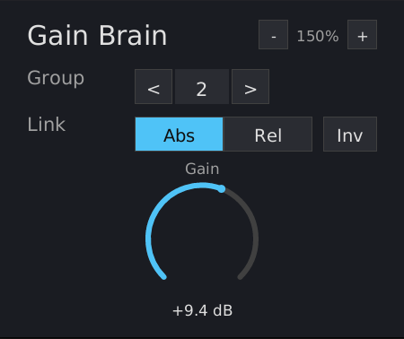

# Gain Brain Manual

{ width=40% }

## What is Gain Brain?

Gain Brain is a lightweight gain utility with cross-instance group linking. Multiple instances across a project can be assigned to the same group, and changing gain on any grouped instance applies that change to all others in the group. Designed for many instances per project.

Inspired by BlueCat's Gain Suite grouping feature.

## Installation

Build from source (requires nightly Rust):

```bash
cargo nih-plug bundle gain-brain --release
```

The bundler outputs to `target/bundled/`. Copy either the `.vst3` or `.clap` file (you only need one -- use whichever your DAW supports) to your plugin directory:

- **Linux**: `~/.vst3/` or `~/.clap/`
- **macOS**: `~/Library/Audio/Plug-Ins/VST3/` or `~/Library/Audio/Plug-Ins/CLAP/`
- **Windows**: `C:\Program Files\Common Files\VST3\` or `C:\Program Files\Common Files\CLAP\`

## Controls

### Gain

Output gain applied to the audio signal. Range: -60 to +60 dB. Default: 0 dB. Displayed as a rotary dial with a 270-degree arc.

Drag vertically to adjust (up = increase, down = decrease). Hold **Shift** while dragging for fine control (10x slower). **Double-click** to reset to 0 dB.

### Group

Select a group for this instance. **X** means no group (standalone). Groups **1-16** are available. Click the **<** and **>** arrow buttons to cycle through groups.

When set to X, the instance operates independently. When set to a group number, gain changes are synchronized with other instances in the same group according to the link mode.

### Link Mode

Controls how gain changes propagate within the group. Only visible when a group is selected (not X). Two modes:

- **Abs** (Absolute) -- all instances in the group maintain identical gain values. When any instance's gain changes, all others snap to that value.
- **Rel** (Relative) -- gain *changes* (deltas) propagate, but each instance keeps its own base gain. All instances gain-ride together while maintaining individual offsets.

Link mode is per-instance, not per-group. You can have some instances in Absolute and others in Relative within the same group.

### Invert (Inv)

Toggle button, only visible when a group is selected. When active (highlighted), this instance's relationship to the group is inverted:

- Gain changes this instance sends to the group are negated
- Gain changes this instance receives from the group are negated

Use case: when this instance goes up, other group members go down (and vice versa). Useful for ducking, sidechain-style workflows, or any scenario where you want mirrored gain movement.

Invert is per-instance. You can have some instances inverted and others not within the same group.

### Scaling

Use the **-** / **+** buttons in the upper right corner, or **Ctrl+=** / **Ctrl+-** on the keyboard. Range: 75% to 300%.

## How Grouping Works

### Cross-Instance Communication

Gain Brain uses an in-process static global for cross-instance communication. All instances in the same host process share 16 lock-free atomic group slots directly in memory. No files are created or accessed. This is the standard approach used by cross-instance linking plugins (e.g. BlueCat Gain Suite) and works with every major DAW, which hosts all instances of the same plugin in one process by default.

### Absolute Mode Example

1. Insert Gain Brain on tracks A, B, and C
2. Set all three to Group 1, Link Abs
3. Drag any instance's gain -- all three follow

### Relative Mode Example

1. Insert Gain Brain on tracks A and B
2. Set both to Group 1, Link Abs, and adjust both to +5 dB
3. Set both to Link Rel
4. Remove B from the group (Group X), drag B to -3 dB, then rejoin Group 1 Rel
5. Now A is at +5 dB and B is at -3 dB -- an 8 dB offset
6. Drag A up by 2 dB -- A goes to +7 dB, B goes to -1 dB (offset preserved)

### Invert Example

1. Insert Gain Brain on tracks A and B
2. Set both to Group 1, Link Abs
3. Enable Inv on instance B
4. Drag A up to +6 dB -- B goes to -6 dB (mirrored)

## Limitations

- **Group linking requires same host process** -- All Gain Brain instances must be in the same host process for group linking to work. This is the default for every major DAW. Instances in separate processes (e.g. sandboxed plugin hosts) will each have independent group state.

## Technical Notes

- **No audio-thread allocations** -- the process() callback never allocates heap memory in release builds
- **CPU rendering** -- uses tiny-skia (software rasterizer) + fontdue (glyph cache) + softbuffer (pixel buffer). No OpenGL context, no GPU drivers loaded
- **In-process shared state** -- lock-free atomic slots, zero overhead. Per-instance memory: ~8 KB headless
- **Zero latency** -- no lookahead or convolution, just a gain multiplier with 50ms linear smoothing
- **Embedded font** -- DejaVu Sans, compiled into the binary. No runtime font loading

## Formats

- CLAP
- VST3
- Standalone (JACK or ALSA backend)

## License

GPL-3.0-or-later
