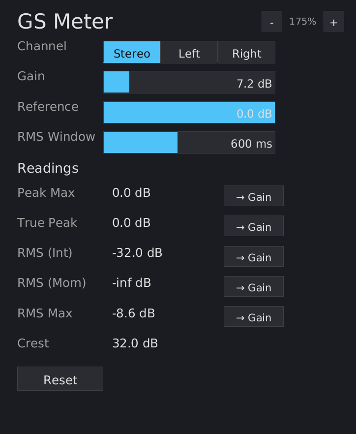

# GS Meter Manual

{ width=50% }

## What is GS Meter?

GS Meter is a lightweight loudness meter with an integrated gain utility, purpose-built for clip-to-zero workflows. It is designed to replace dpMeter5 in projects where you need a meter on every track, bus, and master -- 100+ instances without killing your CPU or eating your RAM.

**If you're not doing clip-to-zero, this plugin is probably not for you.** It has no visual meters, no bar graphs, no loudness history. It shows numbers and lets you set gain from them. That's it.

## Why does this exist?

dpMeter5 is the standard meter for clip-to-zero, but running 100+ instances of any full-featured meter adds up. GS Meter is built from the ground up for density:

- **CPU rendering** -- no OpenGL, no GPU driver loaded. Zero memory overhead when the GUI is closed.
- **SIMD metering** -- peak detection and RMS accumulation use f32x16 SIMD, true peak FIR uses SIMD dot products.

Benchmarks (Bitwig, 48 kHz / 1024 samples, GUI closed):

| Instances | CPU | RSS | Per Instance |
|---|---|---|---|
| 50 | 3.3% | 113 MB | ~1.8 MB, 0.05% CPU |
| 100 | 5.0% | 203 MB | ~1.8 MB, 0.05% CPU |
| 200 | 8.6% | 381 MB | ~1.8 MB, 0.04% CPU |
| 300 | 15.1% | 560 MB | ~1.8 MB, 0.05% CPU |


## Installation

Build from source (requires nightly Rust):

```bash
cargo nih-plug bundle gs-meter --release
```

The bundler outputs to `target/bundled/`. Copy either the `.vst3` or `.clap` file (you only need one -- use whichever your DAW supports) to your plugin directory:

- **Linux**: `~/.vst3/` or `~/.clap/`
- **macOS**: `~/Library/Audio/Plug-Ins/VST3/` or `~/Library/Audio/Plug-Ins/CLAP/`
- **Windows**: `C:\Program Files\Common Files\VST3\` or `C:\Program Files\Common Files\CLAP\`

## Controls

### Gain

Output gain applied to the audio signal. Range: -40 to +40 dB. Default: 0 dB.

This is the gain you adjust to match your reference level. The "-> Gain" buttons next to each reading auto-set this value.

### Reference

Your target level. Range: -60 to 0 dB. Default: 0 dB.

When you click a "-> Gain" button, the gain is set to: `reference - meter_reading`. For example, if your reference is -14 dB and the integrated RMS reads -18 dB, clicking "-> Gain" sets gain to +4 dB.

### RMS Window

The sliding window size for momentary RMS measurement. Range: 50 to 3000 ms. Default: 600 ms.

This matches dpMeter5's RMS Window setting. Changing it resets the momentary max.

### Meter Mode

- **dB** -- RMS-based metering with peak, true peak, integrated/momentary RMS, and crest factor
- **LUFS** -- EBU R128 loudness metering with K-weighted integrated, short-term, momentary, true peak, and loudness range (LRA)

Each mode has its own independent gain and reference values. Switching modes switches which gain is applied to the audio signal.

In LUFS mode, gain is displayed in LU (Loudness Units) and reference in LUFS. The gain-match formula is the same: `Gain = Reference - Reading`. For example, with reference at -14.0 LUFS and integrated reading at -20.0 LUFS, clicking "-> Gain" sets gain to +6.0 LU.

The LUFS mode default reference is -14.0 LUFS (common streaming target). The dB mode default reference is 0.0 dBFS (clip-to-zero).

### Channel Mode

- **Stereo** -- readings sum both channels' power (matches dpMeter5 SUM mode)
- **Left** -- readings from the left channel only
- **Right** -- readings from the right channel only

### Scaling

Use the **-** / **+** buttons in the upper right corner, or **Ctrl+=** / **Ctrl+-** on the keyboard. Range: 75% to 300%.

## Readings

### Peak Max

Highest absolute sample value since reset, in dBFS.

### True Peak

Highest inter-sample peak since reset, in dBTP. Uses 4x polyphase oversampling with the exact ITU-R BS.1770-4 Annex 2 reference filter coefficients (48-tap, 4-phase FIR). At sample rates >=96 kHz, uses 2x oversampling. At >=192 kHz, true peak equals sample peak (no interpolation needed).

True peak may read slightly different from dpMeter5 (typically within 0.1-0.2 dB). This is due to filter design differences -- both implementations comply with the ITU standard.

### RMS (Int)

Integrated RMS since reset. Accumulates the mean-square of all samples processed and reports the square root. Uses f64 accumulation for precision over long measurement periods.

In Stereo mode, this is `sqrt(ms_L + ms_R)` -- the sum of both channels' mean-square power, matching dpMeter5's SUM mode.

### RMS (Mom)

Momentary RMS over the current sliding window (set by RMS Window). Updates continuously.

### RMS Max

Highest momentary RMS value observed since reset. Updated once per audio buffer.

### Crest

Crest factor: `Peak Max (dB) - RMS Integrated (dB)`. Shows the dynamic range of the signal -- higher values mean more transient peaks relative to average loudness. This is a live value that settles as the integrated RMS accumulates.

In Stereo mode, crest factor uses the stereo peak (max of L/R) and stereo RMS (sum of power). This matches dpMeter5's convention but gives values ~3 dB lower than a per-channel crest factor for balanced stereo content.

## LUFS Mode Readings

### Integrated

EBU R128 integrated loudness in LUFS. Uses two-stage gating: absolute gate at -70 LUFS, then relative gate at -10 LU below the absolute-gated mean. Accumulates 400ms blocks with 75% overlap (100ms hop).

### Short-Term / ST Max

Short-term loudness over a 3-second sliding window, in LUFS. ST Max tracks the highest short-term value since reset.

### Momentary / Mom Max

Momentary loudness over a 400ms sliding window, in LUFS. Mom Max tracks the highest momentary value since reset.

### True Peak

Same true peak measurement as dB mode, displayed in dBTP.

### LRA

Loudness Range in LU. Measures the dynamic range of the program material using the 10th and 95th percentiles of gated short-term loudness blocks. Does not have a gain-match button (it's a range measurement, not an absolute level).

### -> Gain Buttons

Each reading (except Crest in dB mode and LRA in LUFS mode) has a "-> Gain" button that sets: `Gain = Reference - Reading`.

In dB mode, use the integrated RMS button for clip-to-zero. In LUFS mode, use the integrated loudness button for broadcast/streaming level matching.

### Reset

Clears all accumulated values in both modes: peak, true peak, RMS, crest, and all LUFS measurements (integrated, short-term, momentary, LRA).

**Double-click** any slider or the channel selector to reset it to its default value.

## Clip-to-Zero Workflow

1. Insert GS Meter on every track and bus (it's cheap -- 100 instances use 5% CPU)
2. Set your reference level to 0 dB (the default)
3. Play a representative section of the song
4. Click the "-> Gain" button next to Peak Max to auto-set the gain
5. Reset and repeat if needed

## Technical Notes

- **No audio-thread allocations** -- the process() callback never allocates heap memory
- **EBU R128 / ITU-R BS.1770-4** -- K-weighting filter (4th-order IIR), gated integration, loudness range with cached O(n log n) percentile computation
- **Pre-allocated buffers** -- RMS rings, LUFS momentary/short-term windows, and LRA scratch buffer are all pre-allocated at construction
- **CPU rendering** -- uses tiny-skia (software rasterizer) + fontdue (glyph cache) + softbuffer (pixel buffer). No OpenGL context, no GPU drivers loaded
- **SIMD** -- uses Rust's portable SIMD (`std::simd::f32x16`) for peak detection, sum-of-squares, and true peak FIR convolution
- **Embedded font** -- DejaVu Sans, compiled into the binary. No runtime font loading

## Formats

- CLAP
- VST3
- Standalone (JACK or ALSA backend)

## License

GPL-3.0-or-later
