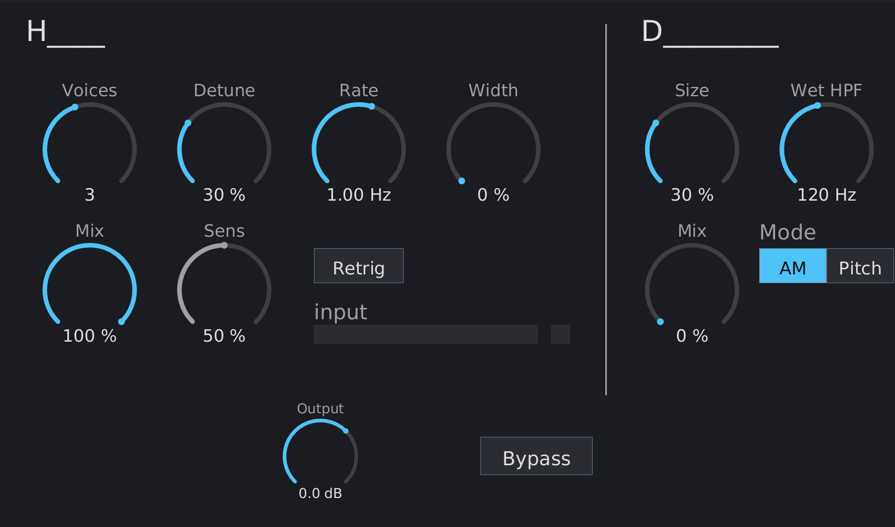

# HD26 Manual

{ width=80% }

## What is HD26?

HD26 is a stereo "thicken and widen" effect built from two independent sections wired in series. On the panel they are labelled **H____** (left) and **D________** (right):

- **H____** is a multi-voice **unison-detune chorus**. It generates up to seven detuned copies of the input whose pitch gently oscillates sharp and flat, turning a thin or mono source into a thick, ensemble-like texture — the same kind of "supersaw" thickening you'd get from oscillator unison, but applied to any audio. It can optionally re-fan its detune from centre on each detected transient.
- **D________** is a **pseudo-stereo widener**. It adds perceived stereo width to a mono or narrow source using a bank of short, out-of-phase delays. Its default mode is **mono-compatible**: when the mix is folded to mono, the widening cancels and you get the dry signal back.

Both sections have their own **Mix** control and can be used alone or together. The whole chain is feed-forward, so HD26 reports **zero latency** and uses no FFT — it is light enough to run on many tracks at once.

## Installation

Build from source (requires nightly Rust):

```bash
cargo nih-plug bundle hd26 --release
```

The bundler outputs to `target/bundled/`. Copy either the `.vst3` or `.clap` file to your plugin directory:

- **Linux**: `~/.vst3/` or `~/.clap/`
- **macOS**: `~/Library/Audio/Plug-Ins/VST3/` or `~/Library/Audio/Plug-Ins/CLAP/`
- **Windows**: `C:\Program Files\Common Files\VST3\` or `C:\Program Files\Common Files\CLAP\`

A standalone build is also available (`cargo build --bin hd26 --release`), useful for testing the GUI without a host.

## Quick Start

1. Insert HD26 on a track and play audio through it.
2. **H____** is active by default (**Voices** = 3, **Mix** = 100 %), so you'll hear thickening immediately. Raise **Detune** for a wider spread and **Rate** to make the movement faster.
3. **D________** starts silent (**Mix** = 0 %). Raise its **Mix** to add stereo width. Leave **Mode** on **AM** for mono-safe widening, or switch to **Pitch** for a lusher, chorus-like motion.
4. To make the detune re-fan rhythmically on each note or hit, turn on **Retrig** and adjust **Sens** while watching the activity LED.
5. Trim the final level with **Output**.

## Controls

HD26's signal flows **input → H____ → D________ → Output**. Each section is blended back against the dry signal by its own **Mix** knob, so you can dial in as much or as little of each as you like.

> In your host's parameter list the controls are prefixed to show which section they belong to — `H Detune`, `H Mix`, `D Size`, `D Mix`, and so on — since both sections share some control names (notably **Mix**).

### H____ — unison-detune chorus (left section)

#### Voices

Number of detuned voices, **0 – 7** (default **3**).

Each voice is a pitch-shifted copy of the input. More voices = a thicker, denser ensemble. **At 0 the section is bypassed** and passes the dry signal through untouched.

#### Detune

Spread depth, **0 – 100 %** (default **30 %**).

Sets how far apart the voices are detuned. The response is deliberately gentle at low settings and opens up steeply near the top: small amounts give a subtle chorus shimmer, high amounts give a wide, supersaw-style fan. The voices are spread asymmetrically around the centre pitch (an even fan of sharp and flat copies), and as more voices are added the outer ones reach further.

#### Rate

Movement speed, **0.01 – 10 Hz** (default **1 Hz**).

The voices' pitch continuously oscillates sharp and flat; Rate is the speed of that oscillation. Low rates give a slow, evolving swell; higher rates give a faster, more obvious chorus warble. Each voice runs at a slightly different rate so the movement never lines up into a single audible wobble.

#### Width

Stereo spread of the ensemble, **0 – 100 %** (default **0 %**).

At **0 %** the left and right channels are processed identically, so a mono input stays perfectly mono (fully mono-safe). Turning Width up decorrelates the two channels — the voices' movement is offset between left and right — spreading the ensemble across the stereo field. (Width on this section is independent of the D________ widener; you can use either or both.)

#### Mix

Dry/wet for the H____ section, **0 – 100 %** (default **100 %**).

Blends the detuned ensemble against the dry signal. At 0 % only the dry signal passes; at 100 % you hear the full ensemble.

#### Sens

Transient sensitivity for **Retrig**, **0 – 100 %** (default **50 %**).

Higher values make the detector fire on smaller transients (more re-triggers); lower values respond only to strong hits. The detector is level-independent — it reacts to the *relative* jump in level, not the absolute loudness — so it behaves the same on quiet and loud material.

Because Sens only affects the audio when **Retrig** is on, the dial is **dimmed when Retrig is off** to show it isn't currently acting on the sound. It remains fully adjustable, and the activity LED stays live (see below) so you can dial Sens in before enabling Retrig.

#### Retrig

Transient re-trigger, **on / off** (default **off**).

When on, HD26 watches the incoming audio for transients (note onsets, drum hits). On each detected transient it **re-aligns every voice oscillation to its starting phase**, snapping the ensemble back to a consistent state — a short "zap" that re-articulates the detune on every hit. This is driven entirely by the audio; no MIDI is required. Typical chorus/ensemble use leaves this off; it is most useful on percussive or monophonic material.

#### Activity meter (input bar + LED)

Below the Retrig button is a small activity display:

- The **input bar** shows the level the transient detector is seeing.
- The **LED** flashes on every detected transient.

The LED flashes whenever a transient is detected, **even when Retrig is off**, so you can watch it and set **Sens** before turning Retrig on. When Retrig is on, each flash also corresponds to a voice re-trigger.

### D________ — pseudo-stereo widener (right section)

#### Size

Delay amount, **0 – 100 %** (default **30 %**).

Scales the length of the widener's internal delays (from roughly a millisecond up to around twenty). Larger sizes produce more perceived width, with more time-smearing of transients; smaller sizes are tighter and more subtle.

#### Wet HPF

High-pass on the widener's wet signal, **20 – 500 Hz** (default **120 Hz**).

Keeps low frequencies out of the widened (side) signal so the bass stays centred and solid. Raise it if low end feels loose or smeared on mono systems; lower it to let more of the low range be widened.

#### Mix

Dry/wet for the D________ section, **0 – 100 %** (default **0 %**).

**At 0 % the section is disabled** — on a fresh insert the widener is silent until you raise this. Increase it to blend in the widened signal.

#### Mode

Widening character: **AM** or **Pitch** (default **AM**).

- **AM** (default) — the widener's delay taps are *amplitude*-modulated and summed out of phase, injecting the wet signal purely into the stereo "sides". This is **mono-compatible**: if the output is folded to mono, the widening cancels and the dry signal returns unchanged. There is no pitch movement, only a gentle, slowly-shifting width.
- **Pitch** — the delay *times* are modulated, with the channels cross-fed in opposite polarity. This gives a richer, more classic chorus-style motion with audible pitch movement, at the cost of full mono-compatibility (some of the effect will partially cancel when summed to mono).

Choose **AM** when mono fold-down matters (broadcast, club systems); choose **Pitch** when you want a lusher, more obviously moving stereo image.

### Global

#### Output

Output trim, **−24 … +12 dB** (default **0 dB**).

Final level after both sections. Useful because high Detune/Voices or a wide D________ setting can change the perceived loudness.

#### Bypass

Plugin bypass, **on / off** (default **off**).

When on, the input passes straight through, unprocessed.

## Interacting with the GUI

- **Drag** a dial up/down to change its value; hold **Shift** while dragging for fine adjustment.
- **Double-click** a dial to reset it to its default.
- **Right-click** a dial to type an exact value (Enter to commit, Escape to cancel).
- Click the **Retrig** / **Bypass** buttons and the **Mode** selector to toggle them.
- The window is **freely resizable**, and its size is saved with your project.

## How it works

**H____** is a multi-voice modulated-delay chorus. Each voice reads a shared, per-channel delay line at a position that is swept by its own low-frequency oscillator; the moving read position Doppler-shifts the pitch up and down, producing the sharp/flat oscillation. The voices' detune amounts are spread asymmetrically around the centre (an even fan of sharp and flat copies), scaled by **Detune**, with **Rate** setting the oscillation speed. **Width** offsets the left/right oscillation phase to decorrelate the channels. **Retrig** resets every voice oscillator to its initial, evenly-staggered phase on a detected transient, re-synchronising the ensemble.

**D________** in **AM** mode is a four-tap complementary-comb widener: four short delays taken from the mono sum, each scaled by a slow amplitude oscillator and summed out of phase, then injected as a pure side signal (`+` to left, `−` to right). Because the wet is purely "side", summing left + right returns the dry mono exactly — that is what makes it mono-compatible. **Pitch** mode instead modulates the delay times and cross-feeds the channels in opposite polarity for a more vibrato-like character.

The transient detector that drives **Retrig** compares a fast envelope to a slow one and fires when their ratio crosses the **Sens**-derived threshold, with a short refractory hold to avoid double-triggering. Because it works on the ratio, it is independent of input level.

The whole chain is feed-forward (a dry path plus delayed/processed taps), so HD26 reports **zero latency** and performs no FFT.

## Parameter summary

| Section | Control | Range | Default |
|---|---|---|---|
| H____ | Voices | 0 – 7 | 3 |
| H____ | Detune | 0 – 100 % | 30 % |
| H____ | Rate | 0.01 – 10 Hz | 1 Hz |
| H____ | Width | 0 – 100 % | 0 % |
| H____ | Mix | 0 – 100 % | 100 % |
| H____ | Sens | 0 – 100 % | 50 % |
| H____ | Retrig | off / on | off |
| D________ | Size | 0 – 100 % | 30 % |
| D________ | Wet HPF | 20 – 500 Hz | 120 Hz |
| D________ | Mix | 0 – 100 % | 0 % |
| D________ | Mode | AM / Pitch | AM |
| Global | Output | −24 … +12 dB | 0 dB |
| Global | Bypass | off / on | off |

## Tips

- **Thicken a mono lead or bass:** H____ with Voices 3–7 and a moderate Detune; leave Width at 0 to keep it mono-safe, then add stereo with D________ in AM mode.
- **Wide pad:** push H____ Detune and Width up, then add D________ (try Pitch mode) for a lush, moving image.
- **Stay mono-safe:** prefer D________ **AM** mode and keep H____ **Width** modest; the **Wet HPF** keeps the low end centred.
- **Rhythmic re-fan:** on drums or plucks, enable **Retrig** and tune **Sens** by watching the LED so the detune snaps back on each hit.
- **Both sections have a Mix:** if you only want one effect, leave the other section's Mix at 0 % (D________ is already at 0 % by default; set Voices to 0 to fully bypass H____).
