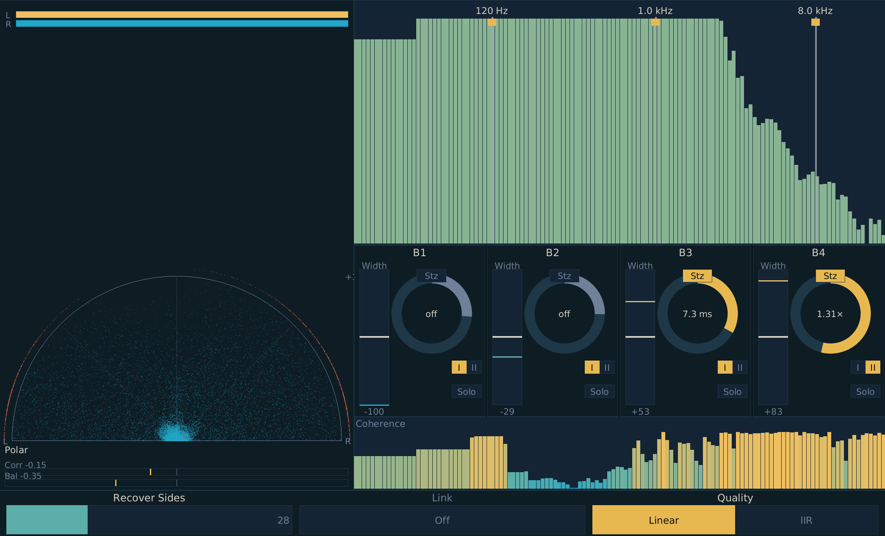

# Imagine Manual

{width=80%}

## What is Imagine?

Imagine is a multiband stereo imager modeled on iZotope's Ozone Imager. It splits the input into four frequency bands and lets you independently control the stereo width, decorrelation amount, and stereoize behavior of each band. Because the controls are per-band, you can tighten the low end while widening the highs, mono-fold a problematic midrange band without touching the rest of the mix, or decorrelate the high shelf to add "air" without smearing the kick.

Three things distinguish Imagine from a naive M/S widener:

- **Ozone-style Width** scales the side channel from 0 (full mono-fold) through unity to 2× (max widening), independent of mid — matches Ozone Imager's per-band Width law.
- **Two Stereoize modes**: Mode I is a Haas-style mid-into-side delay with a 1–20 ms delay-time control (classic, inexpensive); Mode II is a real Schroeder/Gerzon all-pass decorrelator with a 0.5–2.0× delay-scale control (genuinely lowers cross-correlation, not just rotates phase).
- **Recover Sides** folds a Hilbert-rotated residue of removed-side energy back into the mid signal when you narrow a band, so narrowing-without-energy-loss workflows feel natural.

The plugin is intended for both mastering (per-band width control on a stereo bus) and mixing (mono-fold a sub-50-Hz band, widen highs, decorrelate a synth pad).

Inspired by iZotope Ozone Imager.

## Installation

Build from source (requires nightly Rust):

```bash
cargo nih-plug bundle imagine --release
```

The bundler outputs to `target/bundled/`. Copy either the `.vst3` or `.clap` file to your plugin directory:

- **Linux**: `~/.vst3/` or `~/.clap/`
- **macOS**: `~/Library/Audio/Plug-Ins/VST3/` or `~/Library/Audio/Plug-Ins/CLAP/`
- **Windows**: `C:\Program Files\Common Files\VST3\` or `C:\Program Files\Common Files\CLAP\`

A standalone build is also available: `cargo build --bin imagine --release` produces `target/release/imagine`, which connects to JACK on Linux and CoreAudio / WASAPI on macOS / Windows.

## Quick Start

1. Insert Imagine on a stereo bus.
2. Drag any of the three vertical split lines on the spectrum view to choose your band boundaries (defaults: 120 Hz, 1 kHz, 8 kHz).
3. In the band strip on the right, drag any band's vertical **Width** slider up to widen, down to narrow. Negative values fold toward mono.
4. For a quick "tighten the lows" pass: pull band 1's Width to roughly −60 % to −100 %.
5. For "wider highs" without any phase tricks: push band 4's Width to +50 % to +100 %.
6. To add stereo content: click a band's **Stz** toggle to enable stereoize, drag the Stz knob to dial in the Haas delay (Mode I, 1–20 ms) or the decorrelator scale (Mode II, 0.5–2.0×). Switch modes with the **I / II** toggle below the knob.
7. Watch the vectorscope on the left and the coherence bar at the bottom of the spectrum view to see what you're doing to the stereo field.

## The Display

The window has two halves:

- **Left half**: vectorscope (polar / Lissajous toggle), correlation bar, balance bar.
- **Right half**: crossover spectrum on top (with three draggable splits), four-band control strip in the middle, coherence spectrum at the bottom.
- **Bottom global strip**: Recover Sides bar, Link Bands toggle, Quality (Linear / IIR) selector.

### Vectorscope (left)

Four display modes, cycled by clicking the mode label below the scope. The cycle is **Polar → Polar Level → Goniometer → Lissajous → Polar**. Throughout, **gold** denotes the L channel and **deep teal** the R channel.

- **Polar** (default): half-disc dot cloud. Each (L, R) pair is mapped to a polar position where mono in-phase content lands at the top, hard-L / hard-R in-phase content lands on the upper-left / upper-right 45° spokes (the iZotope "safe lines"), and out-of-phase content lands beyond the spokes toward the L / R baseline corners. Samples that exceed 0 dBFS are flagged in **red** beyond the rim. A thin **L / R peak meter strip** sits in the otherwise-empty top of the panel — two stacked dB-scaled bars showing the peak amplitude per channel over the last ~100 ms.
- **Polar Level**: same half-disc geometry as **Polar**, but instead of a dot cloud the audio thread peak-picks the loudest (M, S) sample every 30 ms and emits one ray at that position. Each ray is a thick triangular fan that fades to background over the next ~1 second of emits, so the display reads as a constellation of recently-emitted rays at independent decay states. Per the iZotope Imager manual: ray length = amplitude, ray angle = stereo position. Inside the 45° "safe lines" the rays represent in-phase content; rays beyond the safe lines are out-of-phase. The angle of an out-of-phase ray within its wing reflects how anti-phase the peak sample was — just past the spoke = mildly anti-phase, at the baseline corner = perfectly anti-phase (`L = −R`). Same L / R peak meter strip at the top as Polar mode.
- **Goniometer**: full-square 45°-rotated dot cloud, dual-tone — gold dots are L-dominant samples, teal dots are R-dominant. A mono signal draws a vertical line, an anti-correlated signal draws a horizontal line, a fully decorrelated stereo field fills a circle. Out-of-range samples (rotated coords leaving the unit square) render in red at the clamped edge.
- **Lissajous**: traditional unrotated XY view. X = L (positive right), Y = R (positive up). Mono signals trace a +45° diagonal; anti-phase signals trace a −45° diagonal; hard-L lies on the horizontal axis, hard-R on the vertical axis. Single-tone (gold). Out-of-range samples render in red at the clamped edge.

Below the scope:

- **Correlation bar** (range −1 to +1): the Pearson correlation coefficient between L and R, computed on the audio thread over a sliding window. +1 = mono, 0 = decorrelated, −1 = inverted (phase issue).
- **Balance bar**: short-term L vs R energy difference. Centered = balanced; offset = one channel louder than the other.

### Crossover Spectrum (top right)

Log-frequency display from 20 Hz to 20 kHz. Three vertical lines mark the three crossover splits between the four bands.

- **Drag** any split line horizontally to move that crossover frequency. The bands on either side update immediately.
- The faded backdrop is `|M|` (mid-channel magnitude spectrum) so you can see what's living in each band before deciding where to split.
- The four bands are rendered in alternating teal / gold tints. Each band's tint matches its column in the band strip below.

### Coherence Spectrum (bottom right)

Below the crossover view, a per-bin **coherence** bar shows the magnitude-squared coherence γ²(k) — a measure of how phase-aligned L and R are at each frequency. The plot shows `1 − γ²(k)`:

- **Teal / low** = coherent (phase-aligned, mono-compatible at that frequency).
- **Gold / high** = decorrelated (out of phase, "wide" or unstable).

This is what you actually adjust when you push Width or Stereoize on a band — the coherence at frequencies inside that band shifts toward gold. Use it to confirm that a stereoize move actually decorrelated the band rather than just shifting phase.

### Band Strip (middle right)

Four columns, one per band. Each column has, top to bottom:

- **Band number** (1 = lowest, 4 = highest) and frequency range label (e.g., "120 Hz – 1 kHz").
- **Width** slider: vertical fader, range −100 % to +100 %, default 0 %.
- **Stz** toggle: enables / disables the band's stereoize stage. Default off. The dial below has no audible effect when the toggle is off (its readout shows "off").
- **Stereoize** knob: rotary; meaning depends on the active mode. In **Mode I** it sets the Haas delay time (1–20 ms, default 6.0 ms). In **Mode II** it sets the decorrelator delay scale (0.5–2.0×, default 1.0×).
- **Mode I / Mode II** toggle: which Stereoize algorithm runs in this band.
- **Solo** button: routes only this band to the output (silences the other three).

### Global Strip (bottom)

- **Recover Sides** horizontal bar: 0 %–100 %, default 0 %. Mixes Hilbert-rotated residue of removed-side energy back into mid for bands that were narrowed.
- **Link Bands** toggle: when on, dragging any band's Width changes all four bands by the same delta (useful for global widening / narrowing while preserving relative differences).
- **Quality** 2-segment selector: **Linear** (FIR crossovers, latency = 255 samples ≈ 5.3 ms at 48 kHz) or **IIR** (Linkwitz-Riley, zero latency). Quality is non-automatable — set it once when you load the plugin.

## Per-Band Controls

Each of the four bands exposes three parameters plus solo. The bands themselves have fixed identity (band 1 = lowest, band 4 = highest); the *frequencies* that delimit them are the three global crossover splits.

### Width

Range: **−100 % to +100 %**. Default: **0 %** (passthrough).

Width controls the side-channel gain for the band's frequency content, matching Ozone Imager's **scale-the-side** law:

```
S_gain = (width + 100) / 100        // 0 at width=−100, 1 at width=0, 2 at width=+100
M_gain = 1                          // mid is unchanged at every setting
```

The mid signal is preserved; only the side is scaled. At +100 the side is doubled; at 0 the side is unchanged; at −100 the side is muted (full mono-fold). Drag the band's vertical Width slider, or right-click for numeric entry.

Trade-off: at +100 with strongly stereo content the output can exceed 0 dBFS — handle with downstream gain (standard mastering practice). The earlier constant-power law (M²+S²=2 invariant) was theoretically clean but practically wrong: it removed the mid at +100, which dramatically reduced volume on most music (whose energy is mid-dominated).

### Stereoize

The Stereoize stage *generates* additional decorrelated side content. It has three controls per band:

- **Stz** toggle (above the knob): enables / disables the entire stereoize stage for this band. Default off. Toggling it on/off doesn't click — the internal buffers stay coherent.
- **Stereoize** knob: meaning depends on the active mode (see below). One knob, two interpretations.
- **Mode I / Mode II** toggle (below the knob): switches the algorithm.

#### Mode I (Haas)

Knob range: **1.0 ms to 20.0 ms**. Default: **6.0 ms**.

A delayed copy of the band's mid signal is added back into the side. The knob sets the delay time directly. The Haas effect creates the impression of width by exploiting the precedence effect — the brain treats the delayed copy as a discrete echo from one side, perceiving the source as wider. Cheap, classic, free of phase artifacts at low frequencies.

Trade-off: a Haas move is *not* a true decorrelation. The cross-correlation between L and R doesn't drop much; you're shifting phase coherence, not breaking it. Mono-folding a heavily-Haas'd track produces a comb filter at the delay frequency.

#### Mode II (Schroeder / Gerzon)

Knob range: **0.5× to 2.0×**. Default: **1.0×**.

A 6-stage all-pass cascade with mutually-prime delays {41, 53, 67, 79, 97, 113} samples (at 48 kHz, sample-rate-scaled) processes the band's mid and adds the result into the side. The knob multiplies all six delays by the same scale factor — at 0.5× the cascade is tighter and more "in front", at 2.0× it's more diffuse with a longer reverberant tail.

This is a real decorrelator — cross-correlation drops to roughly **0.3 on broadband noise** at the default 1.0×, vs. roughly 0.8 for a single-stage all-pass.

Trade-off: more CPU than Haas, and the cascade introduces some group delay scattering. On transients you may hear a subtle "smear" — by design, since that smear is what's decorrelating the signal. Higher scale values lengthen the smear; lower values tighten it but reduce the diffusion.

The original spec for this plugin called for a Hilbert-90 phase rotator on mid for Mode II. That design *did not* decorrelate (xcorr stayed near +0.8) — adding a phase-rotated copy of mid into side is mathematically a phase shift, not a decorrelation. The Schroeder/Gerzon cascade is the correct approach.

#### Mode toggle

Click the **I / II** toggle below the Stereoize knob to switch.

### Solo

Click to isolate this band. Other bands are silenced; the recover-sides path is bypassed (so you hear the band's own contribution, not what happens to it after the recover stage). Useful for auditioning a band's effect in isolation.

## Global Controls

### Recover Sides

Range: **0 % to 100 %**. Default: **0 %**.

When you narrow a band (Width < 0 %), some of the original side-channel energy is removed. Recover Sides accumulates that removed-side residue across all narrowed bands, runs it through a **90° Hilbert phase rotator** (FIR, length 65 ≈ 32-sample / 0.7-ms latency at 48 kHz), and folds the result back into the mid channel.

Recover Sides is a *perceptual* control. Adding a phase-decorrelated rotation of the removed side into mid retains some of the spatial impression that narrowing would otherwise lose, without re-introducing the original side energy that you intentionally removed.

A reasonable default workflow: start at 0 %, narrow whatever bands you want to narrow, then push Recover Sides up to 30–60 % until the result feels less "centered" without becoming wide again.

Recover Sides is gated per-band by Width sign: only bands with width < 0 % contribute to the residue. Bands at 0 or positive width don't add anything to the recover path.

### Link Bands

Boolean toggle. Default: **off**.

When on, dragging any band's Width slider applies the same *delta* to all four bands, preserving their relative offsets. Useful for "make everything wider while keeping band 1 narrower than band 4 in the same proportion" workflows.

Stereoize and Mode are not linked — only Width.

### Quality

Two-segment selector: **Linear / IIR**. Default: **Linear**.

This selects the crossover topology:

- **Linear**: linear-phase FIR crossovers (windowed-sinc, length 511). Magnitude-flat sum, perfectly phase-aligned bands. Latency: 255 samples (≈5.3 ms at 48 kHz). Best for mastering work where phase coherence matters.
- **IIR**: 4th-order Linkwitz-Riley with Lipshitz/Vanderkooy delay-matched compensation. Magnitude-flat sum to ±0.05 dB across 20 Hz – 20 kHz. Phase response is **not** linear, but the band sum is true allpass-equivalent (shape preserved). Latency: 0 samples. Best for mixing work where latency budget is tight.

**Quality is non-automatable.** Latency is reported once at `initialize()`; switching mid-stream would change the host's PDC compensation without re-querying. Set it once when you load the plugin.

## How It Works

### Signal flow

```
L, R → M/S encode → 4-band crossover (IIR or FIR by Quality)
     → per-band: Width (constant-power M/S gain) + Stereoize
     → recombine M_sum, S_sum across bands
     → S_sum + recover_amount · Hilbert(S_removed_total)
     → M/S decode → L_out, R_out
```

The dry M/S sums are passed through a delay matching the Hilbert FIR's group delay (~32 samples) so that the Recover Sides injection lines up cleanly when added to S_sum.

### Width law (Ozone-style scale-the-side)

```
S_gain = (width + 100) / 100        # 0 .. 2 across width [-100..+100]
M_gain = 1                           # mid is unchanged
```

The mid signal passes through untouched at every Width setting; only the side is scaled. Width=0 is unity, Width=−100 mutes the side (full mono-fold), Width=+100 doubles the side. This matches Ozone Imager's per-band Width semantics.

The earlier draft of this plugin used a constant-power law (M²+S²=2), which is theoretically clean but practically wrong for a "scale the width" workflow: at +100 the mid was muted, dramatically reducing volume on most music (which is mid-dominated). The current law trades that energy invariance for predictable mid behaviour at the cost of letting hot stereo content exceed 0 dBFS at full-wide — handle with downstream gain.

### Stereoize Mode II details

The Schroeder all-pass cascade:

```
y = ((1 − g²) / (1 + g · z⁻ᵈ)) · x − g · y_delayed
```

repeated 6 times with delays d ∈ {41, 53, 67, 79, 97, 113} (mutually prime to maximize echo density spread) and feedback gain g ≈ 0.7. The output's magnitude spectrum is flat (every all-pass is unity-magnitude); only phase is scrambled. Adding the result into side decorrelates side from mid because the magnitude response is preserved but phase is randomized across frequency.

Cross-correlation measurements (broadband white noise input):

| Configuration                  | xcorr(L, R) |
|---------------------------------|-------------|
| Original Hilbert-90 design     | ~+0.8       |
| Schroeder cascade (Mode II)    | ~+0.3       |

The Schroeder design genuinely decorrelates; the Hilbert-90 design does not.

### Crossover details — IIR

The IIR crossover is a 3-stage cascade of 4th-order Linkwitz-Riley splits at the three crossover frequencies. Each band passes through compensating allpasses for splits it didn't traverse, so the band sum

```
Σ bands = AP3 ∘ AP2 ∘ AP1 (input)
```

is true allpass-equivalent — magnitude-flat to ±0.05 dB across the audible range.

### Crossover details — FIR

The FIR crossover designs four band-pass filters via complementary windowed-sinc pairs (length 511, Blackman-Harris window). Each filter is double-buffered: when a crossover frequency moves by more than 0.5 Hz, the new tap set is computed in a back buffer and a sample-wise crossfade swaps the active set without clicks. The redesign is gated on >0.5 Hz change so static-parameter playback doesn't pay for a continuous crossfade.

### Hilbert details

The Hilbert phase rotator is a Type-IV anti-symmetric FIR (length 65). It rotates every frequency by exactly 90°, with constant group delay of `(N − 1) / 2 = 32` samples. The plan originally specified an IIR all-pass cascade for zero-latency Recover Sides, but a single all-pass cascade can't produce 90° at low frequencies, and the standard Niemitalo analytic-pair design produces an `(real, imag)` pair where `imag` is rotated relative to `real` — not relative to the input. The FIR is mathematically exact; ~0.7 ms latency at 48 kHz is below human perception threshold.

## Interaction

- **Drag** a vertical Width slider up / down to set width.
- **Click** a band's **Stz** toggle to enable / disable that band's stereoize stage.
- **Drag** the Stereoize knob to set the Mode I delay (ms) or the Mode II delay scale (×), depending on the active mode.
- **Click** the **I / II** toggle below the Stereoize knob to switch algorithm.
- **Click** a band's Solo button to isolate it.
- **Drag** a crossover split line in the spectrum view horizontally to move it.
- **Drag** the Recover Sides bar to set the amount.
- **Click** the Link Bands toggle to enable / disable global Width linking.
- **Click** the mode label below the vectorscope to cycle through Polar → Polar Level → Goniometer → Lissajous.
- **Click** the Quality selector to switch between Linear and IIR (latency change — set once at load).
- **Right-click** any continuous control (Width, Stereoize, Recover Sides, crossover splits) for numeric entry. **Enter** commits, **Escape** cancels, clicking outside auto-commits.
- The window is **freely resizable** — drag the bottom-right corner. Size persists with the host session.

## Tips

### Mastering workflows

- **Tighten the sub**: drag crossover 1 to 80–120 Hz, set band 1 Width to −100 %. The sub is now mono. Watch the coherence bar stay solid cyan in that frequency range.
- **Widen the air**: drag crossover 3 to 6–10 kHz, set band 4 Width to +30–60 %. Keep Stereoize at 0 % to avoid phase artifacts.
- **Per-band stereoize for synth pads**: pick band 3 (mids), set Stereoize to 30–50 % in **Mode II**. The mid range gains decorrelated width without smearing the kick or high hats.
- **Use Linear Quality** for masters — phase coherence matters, latency is acceptable.

### Mixing workflows

- **Mono-fold problem frequencies**: if a synth bass has phase issues around 200–400 Hz, set crossover 1 = 150 Hz, crossover 2 = 500 Hz, band 2 Width = −100 %. The problem range mono-folds without affecting the rest.
- **Use IIR Quality** for tracking and most mixing — zero latency keeps things tight.
- **Solo each band** while you set crossover splits to confirm what's living where.

### Common pitfalls

- **Pushing Width past 0 dBFS**: at +100 with strongly stereo content the side doubles, so the channel sum can clip. The half-disc Polar / Polar Level views flag clipping samples in red beyond the rim and show per-channel peaks in the L/R meter strip at the top — keep an eye on those, drop the band's Width or pull a Trim plugin downstream if they're lighting up.
- **Stacking Stereoize Mode I across bands**: each band's Haas delay produces a comb on mono-fold. Test with a mono-down to verify your master isn't going to fall apart on a phone speaker.
- **Forgetting Recover Sides** when you narrow heavily: a band at width = −80 % loses spatial impression. Recover Sides at 30–50 % brings back perceptual width without re-introducing the side energy.

### CPU profile

Linear Quality (FIR crossovers) is the heavier mode. For a single instance at 48 kHz / 1024-sample buffer:

- **Linear**: ~0.4–0.6 % CPU per instance.
- **IIR**: ~0.15–0.25 % CPU per instance.

Stereoize Mode II is slightly more expensive than Mode I (six all-pass stages vs one delay), but the difference is negligible.

The plugin is suitable for use on multiple buses simultaneously. Tested at 16 instances @ ~5 % CPU.

## Technical Notes

- **No audio-thread allocations.** The `process()` callback never allocates heap memory.
- **Width** scales only the side channel (mid passes through unchanged). +100 doubles side, −100 mutes side. Matches Ozone Imager's Width law.
- **Stereoize Mode I** is a Haas mid-into-side delay; the user-exposed `stz_ms` parameter (1–20 ms) sets the tap directly. Toggling the stage on/off doesn't click — the Haas buffer keeps advancing while disabled.
- **Stereoize Mode II** uses a 6-stage Schroeder/Gerzon all-pass cascade with prime-spaced delays {41, 53, 67, 79, 97, 113}. The user-exposed `stz_scale` parameter (0.5–2.0×) multiplies all six delays; buffers are oversized at construction so the scale can change at runtime without reallocating. Genuinely decorrelates (xcorr < 0.3 broadband at the default 1.0×).
- **Linear-phase FIR crossovers** use double-buffered tap arrays + sample-wise crossfade on coefficient swap, gated on >0.5 Hz frequency change so static-param workloads don't pay for a continuous crossfade.
- **IIR crossovers** use Lipshitz/Vanderkooy delay-matched cascade so the 4-band sum is true allpass-equivalent (magnitude-flat to ±0.05 dB).
- **Hilbert** is FIR-only (Type-IV anti-symmetric, length 65, ~32-sample latency). Mathematically exact 90° rotation across the band; ~0.7 ms latency is below human perception threshold.
- **Spectrum + coherence** display uses the complex M+jS FFT trick to recover both `|M|` and `|S|` spectra in a single transform. Magnitude-squared coherence γ²(k) is computed audio-side via smoothed auto/cross spectra; published as `1 − γ²` per log-spaced bin so the GUI just blits the bar.
- **Vectorscope ring buffer** uses per-sample `AtomicU32` storage (f32 stored as bit-pattern) to avoid `unsafe` while remaining lock-free SPSC. Capacity 32 768 sample pairs.
- **CPU rendering.** Uses tiny-skia (software rasterizer) + fontdue (glyph cache) + softbuffer (pixel buffer). No OpenGL context, no GPU drivers loaded.

## Formats

- CLAP
- VST3
- Standalone (JACK on Linux; CoreAudio on macOS; WASAPI on Windows)

## License

GPL-3.0-or-later
