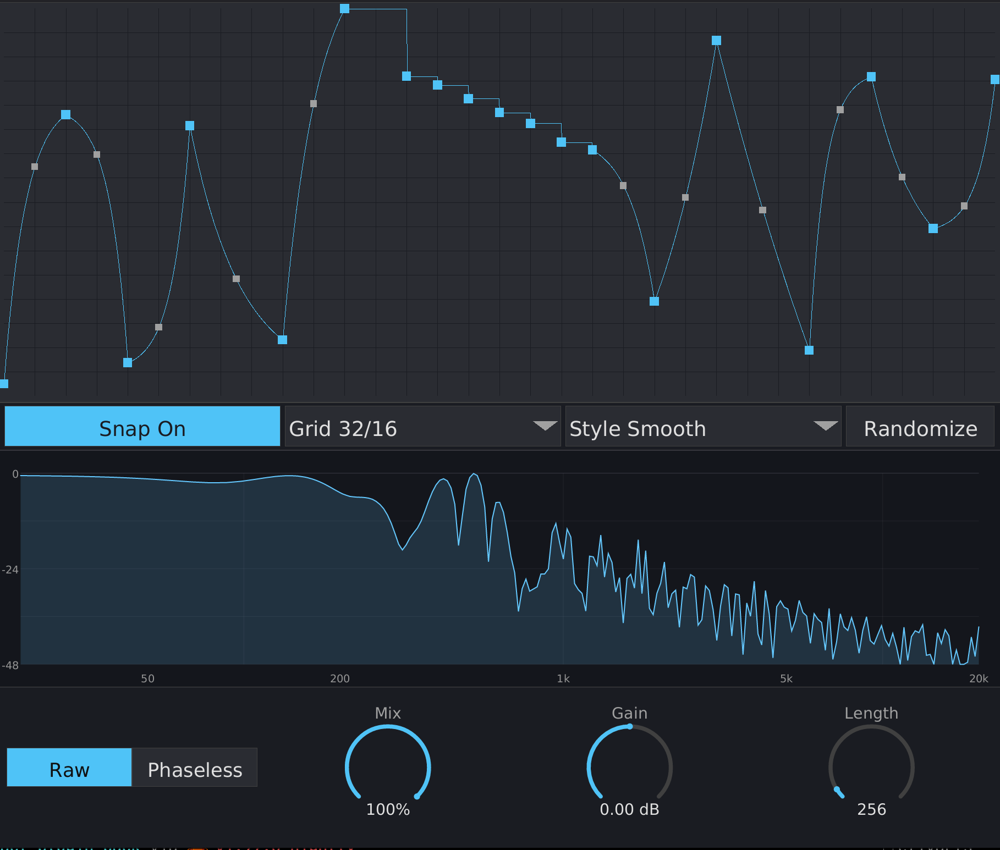

# Overview

miff is an audio effect plugin (VST3/CLAP) that filters audio through a FIR
kernel you draw by hand. Instead of loading a wavetable or dialing in a
conventional EQ, you sketch a curve in a multi-segment envelope (MSEG) editor,
and that curve *becomes* the filter's impulse response.

This makes miff a sibling of Wavetable Filter — both are wavetable-style FIR
convolution filters — but where Wavetable Filter takes its kernel from a loaded
wavetable file, miff takes its kernel from a shape you draw.

The plugin supports two filtering modes:

- **Raw** — Direct time-domain convolution. Zero reported latency.
- **Phaseless** — STFT magnitude-only filtering. No pre-ringing, at a constant
  2048-sample latency.

{ width=100% }

# How miff works

Understanding one idea makes everything else in miff make sense:

**The curve you draw is the filter's impulse response — the kernel itself, in
the time domain.** It is *not* a picture of the frequency response. The
frequency-response view in the middle of the window is the *result* of the
curve (its Fourier transform), not something you draw directly.

## The bipolar midline

The MSEG editor's vertical range is 0 to 1, but FIR taps are bipolar (they can
be positive or negative). miff bridges this with a simple mapping applied to
every point of the curve:

$$\text{tap} = 2 \times \text{value} - 1$$

So:

- A curve value of **0.5** maps to a **zero** tap — the midline is silence.
- Values **above 0.5** produce **positive** taps.
- Values **below 0.5** produce **negative** taps.

A flat curve sitting on the 0.5 midline therefore bakes to an all-zero kernel,
and miff treats an all-zero kernel as **dry passthrough**. A freshly inserted
miff colours nothing until you draw something — it is safe to place on any
track.

Because the midline is a true zero, drawing *across* it — partly above, partly
below — is what makes highpass, bandpass, and comb-like filters possible from
an editor whose Y axis only runs 0 to 1.

## Peak-magnitude normalisation

After baking the curve into taps, miff measures the kernel's strongest
frequency-response magnitude and scales the whole kernel so that peak sits at
exactly 0 dB. The filter therefore **never boosts** any frequency above unity,
and loudness stays consistent no matter what shape you draw.

# Interface

The editor window is freely resizable — drag any edge or corner. The size is
persisted with your DAW project, and all elements scale proportionally. The
window has three regions, top to bottom: the MSEG curve editor, the
frequency-response view, and the control strip.

## MSEG curve editor (top)

This is where you draw the kernel. The curve is defined by **nodes** connected
by **segments**.

### Drawing and editing

- **Click empty canvas** — add a node at the pointer.
- **Drag a node** — move it. Interior nodes stay between their neighbours; the
  first and last nodes are pinned to the left and right edges (their value can
  still move).
- **Drag a segment's tension handle** — bend the segment between two nodes from
  a straight line into an exponential curve.
- **Double-click a node** — delete it.
- **Right-click a segment** — toggle it **stepped**. A stepped segment holds its
  start node's value flat until the next node, instead of interpolating.
- **Shift+drag** — fine adjustment (smaller movement per pixel).
- **Alt+drag** — **stepped-draw**: paint a staircase directly. As the pointer
  crosses each grid cell, miff places one stepped node at your cursor height.
  Dragging back over cells you have already painted *repaints* them — it does
  not stack extra nodes.

### Control strip

A row of controls sits below the curve canvas:

- **Snap** — when on, new and dragged nodes snap to the grid (columns =
  *time divisions*, rows = *value steps*). Hold **Shift** while dragging to
  bypass snapping temporarily.
- **Grid** — a dropdown of grid presets, shown as *time divisions / value
  steps* (for example `16 / 8`). The grid also drives stepped-draw cell size
  and the randomiser's node count.
- **Style** — a dropdown selecting the randomiser style: **Smooth**, **Ramps**,
  **Stepped**, **Spiky**, or **Chaos**.
- **Randomize** — replace the current curve with a fresh random one in the
  selected style. Each click produces a different result.

## Frequency-response view (middle)

This shows the **result** of your curve: the magnitude spectrum of the baked
kernel, on a log-frequency / dB scale (20 Hz–20 kHz, 0 to −48 dB). The peak of
the response always sits at 0 dB because of peak-magnitude normalisation.

When audio is flowing, a faint amber shadow shows the input signal's spectrum,
making it easier to line the filter's shape up with the material you are
treating. With a flat (all-zero) kernel the view is empty — there is nothing to
show.

See *Understanding the frequency response* below for why the response curve
behaves the way it does.

## Control strip (bottom)

- **Mode** — a two-segment selector: **Raw** / **Phaseless**. Click a segment
  to switch.
- Three dials: **Mix**, **Gain**, **Length**.

All dials support:

- **Vertical drag** — up to increase, down to decrease.
- **Shift+drag** — fine adjustment.
- **Double-click** — reset to default.
- **Right-click** — open a text-entry field seeded with the current value
  (unit stripped). Enter commits, Escape cancels; clicking outside or starting
  a drag auto-commits.

### Mix

Blends the dry (unfiltered) input with the wet (filtered) output.

- Range: 0% (fully dry) to 100% (fully wet)
- Default: 100%

### Gain

Output gain applied after the filter and the dry/wet mix. Useful for matching
levels.

- Range: −20 dB to +20 dB
- Default: 0 dB

### Length

The number of FIR taps the curve is baked into — effectively the kernel's
length. Longer kernels resolve lower frequencies and roll off the high end more
steeply; shorter kernels keep the response brighter (see below).

- Range: 64 to 4096 taps
- Default: 256

**Length is not automatable.** Re-baking the kernel is a short FFT that runs on
the GUI thread when you release the dial or commit a text entry. Marking the
parameter non-automatable keeps that work off the audio thread — Length will
not respond to host automation lanes.

# Filter Modes

## Raw Mode

Direct time-domain convolution of the input with the baked kernel, accelerated
with 16-wide SIMD.

**Characteristics:**

- Zero latency reported to the host.
- Linear-phase response — symmetric pre-ringing around sharp transients,
  characteristic of linear-phase FIR filters.
- A silence fast-path skips the convolution entirely while the signal and
  filter history are both zero.

## Phaseless Mode

Short-Time Fourier Transform filtering: the input is windowed, transformed,
multiplied by the kernel's *magnitude* spectrum, and inverse-transformed with
50% overlap-add. Only magnitudes are applied — the input's phase is left alone.

**Characteristics:**

- No pre-ringing — transient shape is preserved.
- Slight temporal smearing from the overlap-add (inherent to the technique).
- A constant **2048-sample latency**, reported to the host for delay
  compensation. The STFT frame is fixed at 4096 points regardless of the
  Length setting, so this latency never jumps when you adjust Length.

# Understanding the frequency response

Because the curve is the *impulse response*, the frequency-response view is its
Fourier transform — and that has some consequences worth knowing.

## Why the response slopes downward

A hand-drawn curve with a handful of nodes is a **slowly varying** signal. Slow
time-domain signals concentrate their energy at **low frequencies**, so the
response naturally rolls off toward the top end. Two separate effects produce
the downward slope you will usually see:

1. **DC tilt.** If your curve spends more area *above* the 0.5 midline than
   below it, the taps sum to a non-zero total — energy at 0 Hz. After
   normalisation that pins 0 dB at the far left and the whole curve slides
   downhill. **Drawing balanced around the midline** — roughly equal ink above
   and below 0.5 — cancels this and moves the response peak up off DC.

2. **Roll-off above the node rate.** Even with no DC tilt, a curve built from a
   limited number of nodes simply cannot contain detail finer than its node
   spacing. Above that rate the spectrum must roll off. You can move the peak
   higher, but the roll-off above it is unavoidable.

## Pushing energy into the high end

To make a brighter filter — or to flatten the slope — give the kernel faster
tap-to-tap variation:

- **Shorten Length.** The same curve shape packed into fewer taps varies faster
  relative to the sample rate, so the response reaches higher. Longer Length
  rolls off sooner.
- **Add nodes.** A finer Grid (and the grid-aware Randomize) packs in more
  nodes, raising the rate at which the curve can change.
- **Use stepped or spiky shapes.** Sharp, stepped tap-to-tap jumps inject
  broadband high-frequency content that a smooth curve never can. Alt-drag
  stepped-draw is the quickest way to get there.

# Tips

- **A fresh miff does nothing on purpose.** The default flat-0.5 curve bakes to
  an all-zero kernel — dry passthrough. Draw a shape to hear the filter.
- **Draw across the midline for highpass and comb filters.** Shapes that stay
  entirely above 0.5 behave lowpass-ish; crossing the midline opens up
  highpass, bandpass, and comb responses.
- **Balance the curve around 0.5** if the response tilts more than you want —
  see above.
- **Use Phaseless on transient-heavy material** (drums, percussion) to avoid
  linear-phase pre-ringing.
- **Use Raw on sustained sounds** (pads, drones) where zero latency and
  linear-phase clarity matter more than transient preservation.
- **Randomize is a fast way to explore.** Pick a Style, click Randomize until
  something interesting appears, then refine it by hand.
- **Watch the amber input shadow** in the response view to line the filter's
  shape up with the frequencies actually present in your signal.

# System Requirements

- **Formats:** VST3, CLAP, Standalone
- **OS:** Linux (other platforms may work but are untested)
- **CPU:** x86_64 or Apple Silicon (SIMD via Rust's portable `std::simd`)
- **DAW:** Any VST3 or CLAP compatible host (tested with Bitwig Studio)

# Building from Source

Requires nightly Rust (for portable SIMD).

```bash
# Plugin bundles (VST3 + CLAP)
cargo nih-plug bundle miff --release

# Standalone binary
cargo build --bin miff --release
```
