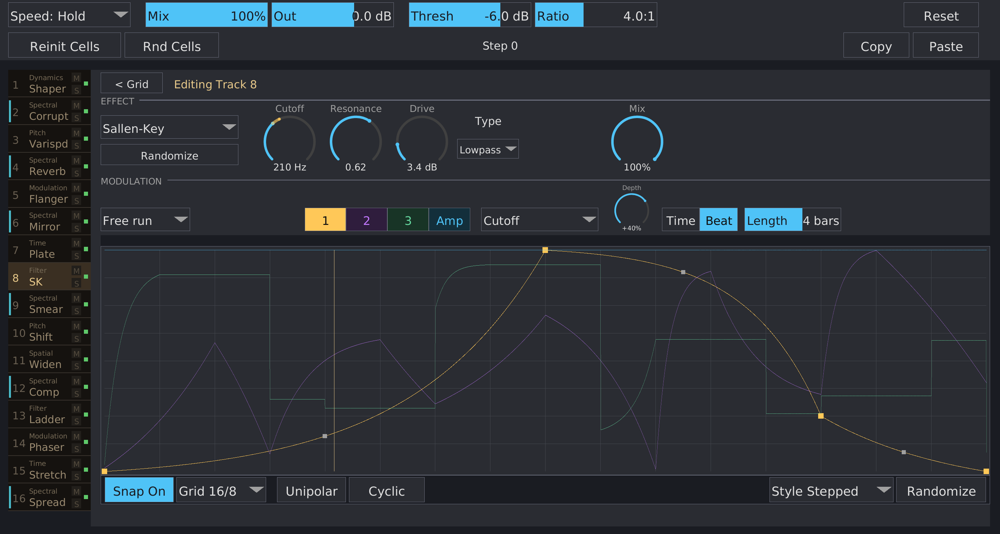
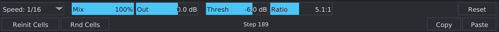
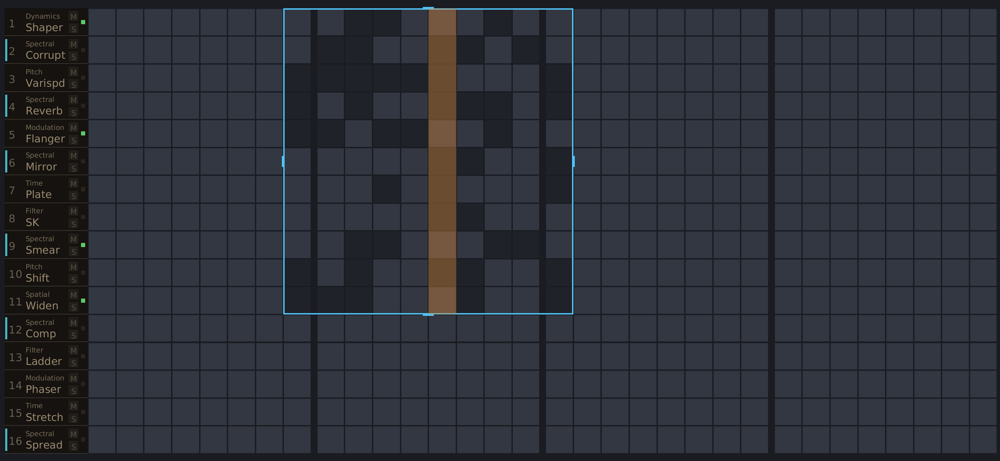
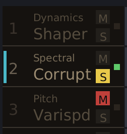
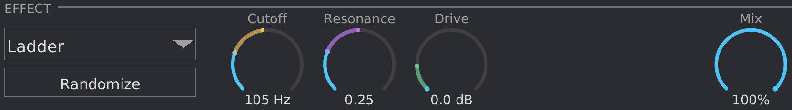
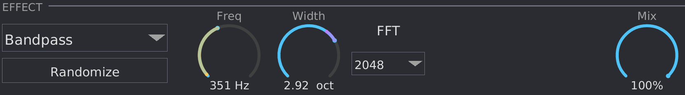
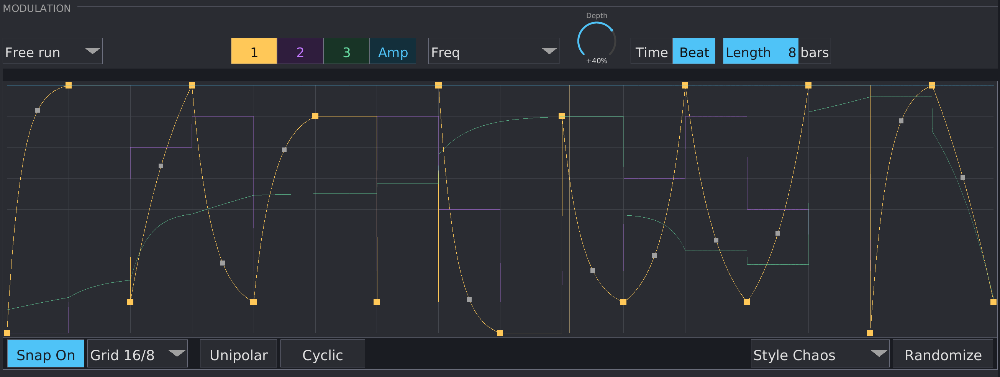
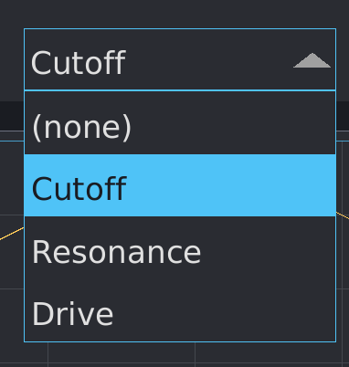

# Multosis Manual

{ width=80% }

## What is Multosis?

Multosis is a **16-row grid step sequencer where each row hosts a per-row audio effect driven by per-row MSEGs**. The active rows on each step form a **series chain** — row 1's output feeds row 2, which feeds row 3, and so on down through row 16. The playhead advances at a tempo-synced rate through up to 32 columns; on every step, only the rows whose cell is lit (and which aren't muted) contribute to the chain, with up to four MSEG curves per row shaping the effect's parameters in real time.

50 effect kinds are bundled, organised into nine families plus the "None" passthrough: Distortion, Dynamics, Filter, Misc, Modulation, Pitch, Spatial, Time, Spectral. They span everything from a Moog ladder filter to a Dattorro plate reverb to fourteen FFT-based spectral effects.

## Installation

Build from source (requires nightly Rust):

```bash
cargo nih-plug bundle multosis --release
```

The bundler outputs to `target/bundled/`. Copy either the `.vst3` or `.clap` bundle (you only need one — use whichever your DAW supports) to your plugin directory:

- **Linux**: `~/.vst3/` or `~/.clap/`
- **macOS**: `~/Library/Audio/Plug-Ins/VST3/` or `~/Library/Audio/Plug-Ins/CLAP/`
- **Windows**: `C:\Program Files\Common Files\VST3\` or `C:\Program Files\Common Files\CLAP\`

## Quick Start

1. Insert Multosis on a track.
2. Click cells in the **grid** to activate steps on whichever rows you want.
3. Click a row in the **track list** on the left to open Effect view, then pick an effect from the **Kind** dropdown.
4. Set the **Speed** in the top toolbar (e.g., `1/8`) to choose how fast the playhead steps. Default is **Hold** (playhead frozen).
5. Hit play on your DAW transport. The playhead traverses the grid; on every step the active rows form a series chain (top-down: row 1 → row 16) processing the incoming audio.
6. Back in Effect view, set parameter values on the row's dials and optionally draw **MSEGs** to modulate them over time.
7. Adjust the per-row **Mix** dial (dry/wet for that effect) and the master **Output** to balance the overall signal.

## The interface

{ width=80% }

The plugin window has two views — **Grid view** and **Effect view** — that share a common top toolbar and left-side track list. Only the central area swaps between them.

- **Top toolbar (two rows)** — Upper row: Speed selector, master Mix, master Output, wet-bus Compressor (Threshold + Ratio), Reset. Lower row: Reinit Cells, Rnd Cells, Copy, Paste, plus a "Step N" status readout in the middle.
- **Track list** — the 16-row strip on the left. Each entry shows row number, effect name (with family caption), M / S buttons, and a sounding indicator. Click a row to open Effect view for that row; drag a row onto another to swap them.
- **Grid view** — the central 16-row × 32-column step grid. The playhead column is highlighted as it advances. Cells toggle on click and paint on drag.
- **Effect view** — opens when you click a track-list row. Shows that row's effect-kind dropdown, parameter dials, per-row Mix dial, and the MSEG editor with its modulation routing. A `< Grid` button at the top-left returns to the grid view.

## Master controls (top toolbar)

### Speed

A stepped selector for the tempo-synced playhead advance rate. The values map to musical subdivisions:

| Label | Meaning |
|---|---|
| **Hold** | Playhead frozen — the sequencer doesn't advance. Effects and modulation keep running on whatever rows are currently active. |
| **1/32** | Step every 1/32 note |
| **1/16** | Step every 1/16 note |
| **1/8** | Step every 1/8 note |
| **1/4** | Step every 1/4 note |
| **1/2** | Step every half note |
| **1/1** | Step every whole note |

Default is **Hold**. The Speed param is automatable from the host.

### Mix

The plugin-level dry/wet blend, 0..100 %, default 100 % (fully wet). At 0 % the plugin is bypass.

### Output

Post-mix output gain, range -30 dB to +12 dB, default 0 dB. Smoothed over 20 ms so MSEG-modulating it doesn't click.

### Comp Threshold / Comp Ratio

A peak compressor on the wet path, between the row chain output and the dry/wet mix. Threshold range is -24 to 0 dB (default -6 dB), Ratio is 1..20:1 (default 4:1). Set Ratio to 1:1 to bypass. The compressor is stereo-linked with fixed 5 ms attack, 50 ms release, and a 6 dB soft knee.

### Reset

A clickable button that re-arms the sequencer: the playhead returns to the loop region's left edge on its next tick, the step counter resets to 0, and all effect DSP state, MSEG phases, and the wet-bus compressor envelope clear. The host transport stopped→playing edge triggers the same reset automatically.

### Grid operations (lower toolbar row)

The lower toolbar row holds four grid-mutating buttons and a step-counter readout:

- **Reinit Cells** — restores every cell in the grid to enabled (the default pattern).
- **Rnd Cells** — randomizes the enabled flags inside the current loop region.
- **Copy** — copies the loop-region cells to an internal clipboard.
- **Paste** — pastes the clipboard back into the loop region.
- **Step N** — read-only counter showing how many steps the playhead has advanced. Resets when you click **Reset** or the transport restarts.

## The grid

{ width=80% }

The grid is **16 rows × 32 columns**, arranged in four groups of eight columns. Each cell is either inactive (dim) or active (lit). The playhead scans the **loop region**'s columns left to right and wraps at its right edge back to its left edge (not to the leftmost grid column — see Loop region below). As the playhead enters each column, the rows whose cell is active there (and which aren't muted) form a series chain in row order from top to bottom: row 1's output feeds row 2, then row 3, and so on down through row 16. Rows with an inactive cell at the current column, rows outside the loop region's row span, and effectively muted rows are skipped.

**Editing the grid:**

- **Click** a cell to toggle it on or off.
- **Drag** to paint a run of cells. A normal drag paints **on**; a Shift-held drag paints **off**.

**The loop region** is a rectangular subset of the grid drawn as an overlay. The playhead only scans inside it, and only rows inside its row span are eligible to sound. Drag its interior to move it; drag near an edge or corner (within ~6 px) to resize it. **Rnd Cells**, **Copy**, and **Paste** in the lower toolbar operate on this region.

**Opening a row's Effect view:** click anywhere on a row's entry in the left-side track list. From the Effect view, click `< Grid` at the top-left to return.

**Playback state:** when the host transport is stopped, the playhead freezes; effects keep processing the current column. When the transport starts the sequencer resets (see [Reset](#reset)) — the playhead returns to the loop region's left edge on its first step boundary.

## Track list (per-row controls)

{ width=80% }

The track list is the 16-row strip on the left of the window, present in both Grid and Effect views. Each row corresponds to one grid row and shows:

- **Row number** — "1"-"16" at the left edge.
- **PDC** (plugin delay compensation) **stripe** — a thin teal vertical bar at the very left edge, shown only for rows whose effect adds latency (see [Latency](#latency)) and that aren't muted.
- **Effect name** — the current effect, shown with a small warm-grey family caption (e.g. "Filter") above the unique suffix (e.g. "Ladder"). The family caption disambiguates similarly-named effects (Modulation `Phaser` vs Filter `Phaser Filter`). The `None` kind is shown as a single line with no caption.
- **M button** (Mute) — small square; lights red when active. Bypasses this row's effect; the dry signal passes through unchanged.
- **S button** (Solo) — small square directly below **M**; lights yellow when active. When any row is soloed, every non-soloed row is muted. A row that is BOTH muted and soloed stays muted (your mute intent wins).
- **Sounding dot** — a small dot at the right edge of the entry; lights green while that row is currently audible, dark otherwise.

**Click anywhere on the row body** (except M / S) to open the Effect view for that row. The selected row is highlighted in gold while Effect view is open.

**Drag a row onto another row** to swap them. The swap moves grid cells, effect parameters, MSEGs, and audio engine state together, and is captured as a single undo entry.

## The effect editor

{ width=60% }

Clicking a row in the track list opens **Effect view** for that row. The toolbar and track list stay visible; the central grid is replaced by the effect editor. Click `< Grid` at the top-left of the view to return.

The effect editor has two sections, **EFFECT** and **MODULATION**. The EFFECT section holds:

- **Kind dropdown** — shows the current effect; click to open a sectioned, family-grouped list of all 50 effect kinds. The dropdown supports keyboard navigation: arrow keys, Enter / Escape, Home / End, PgUp / PgDn, and character search.
- **Randomize button** — randomises the current effect's parameters. If the current kind is `None`, it also picks a random unused effect kind. The Mix dial is never touched by Randomize.
- **Parameter dials** — up to five slots, plus the Mix dial. Two kinds of control appear:
  - **Continuous dials** show the current value and respond to drag. Hold **Shift** while dragging for fine control. **Double-click** resets to the parameter default. **Right-click** opens a text-entry field — Enter commits, Escape cancels.
  - **Enum (stepped) parameters** — e.g. the Distortion `Type`, the SVF `Poles`, the spectral `FFT` selector — are drawn as **dropdown triggers**, not dials. Click to open a popup of the labelled options. Enum params do not respond to drag, double-click, or right-click.
- **Mix dial** — a fixed slot to the right of the parameter dials. Per-row dry / wet blend, 0..100 %. Independent of the master Mix. Double-click resets to 100 %; right-click types a value.
- **Live modulation arcs** — each continuous dial draws a coloured arc overlay showing the current modulated position. The arc colour matches the MSEG slot driving the parameter (Amp sky blue, MSEG 1 amber, MSEG 2 purple, MSEG 3 mint).
- **Dimmed dials** — a continuous dial drawn in muted colour is currently inactive because another setting has overridden it. The Delay's `Free` dial dims when `Time` is set to a sync subdivision; the Repeat's `Rate` dial dims when `Snap` is a sync subdivision.

{ width=60% }

The FFT selector on every Spectral-family effect sits in the rightmost dial slot (before Mix) and offers "512", "1024", "2048", "4096". Changing it switches the FFT analyser size and the effect's reported latency on the fly (see [Latency](#latency)).

## MSEGs (per-row modulation)

{ width=60% }

Every row has four **MSEG** (multi-segment envelope generator) slots that you draw curves into and use to modulate the row's effect parameters over time. The MSEG editor and its routing controls live in the **MODULATION** section of the Effect view, below the parameter dials.

### Slots and selector

The four slots are selected by a 4-tab strip at the top of the MODULATION section, labelled left to right:

- **"1"** — assignable MSEG (amber). Default selection.
- **"2"** — assignable MSEG (purple).
- **"3"** — assignable MSEG (mint).
- **"Amp"** — the row's amplitude envelope (sky blue). Always drives this row's gain; not a routable target.

While editing one slot, the other three are drawn faintly behind it as ghost curves in their slot colours.

### Routing controls (above the canvas)

These controls appear in a strip above the curve canvas; some appear only conditionally:

- **Trigger** — dropdown to the left of the slot selector. Picks what resets the MSEG's phase to zero. The setting is per-track and applies to all four MSEGs on the row at once:
    - **Free run** (default) — phases never reset. The MSEGs cycle continuously, locked to the host transport (Beat sync) or to a fixed wall-clock rate (Time sync).
    - **Cell light** — phases reset on the row's inactive → active edge: when the playhead enters an active cell on this row after a stretch of inactive cells. Use for one-shot envelope behaviour that re-arms per gesture.
    - **Cell step** — phases reset on every step boundary where the row's cell is lit. Use when you want the same envelope shape to fire fresh on every active step.
    - **Free Hz** — phases reset at a fixed rate, independent of the host transport. The rate is set by the **Rate** dial (see below).
    - **Transient** — phases reset when an onset is detected in the plugin's input audio. Detection is a fast/slow envelope-follower ratio crossing a threshold; the **Sens** and **Hold** dials below tune it.
- **Rate** (Free Hz trigger) — appears beside the Trigger dropdown only when **Free Hz** is selected. Sets the re-fire frequency in Hz.
- **Sens** (Transient trigger) — appears beside the Trigger dropdown only when **Transient** is selected. Sets the onset detection threshold; right = more sensitive (lower threshold).
- **Hold** (Transient trigger) — appears to the right of **Sens** when **Transient** is selected. Sets the post-fire refractory period (in ms) during which further onsets are ignored, so the transient's tail doesn't trigger repeated re-fires.
- **Target** — dropdown shown for the three assignable MSEGs (`1` / `2` / `3`). Lists `(none)` plus the names of every parameter on the current effect. Picking one routes that MSEG to that param. Not shown for `Amp`.
- **Depth** — bipolar `-1..+1` dial shown for the three assignable MSEGs. Double-click resets to 0. Drag-only (no text entry).
- **Sync mode** — 2-tab `Time` / `Beat`. Sets whether the MSEG's loop length is given in seconds or in musical subdivisions.
- **Length** — slider whose range depends on Sync mode. **Time** mode is continuous (0.05–32 s, log). **Beat** mode snaps to an 11-step ladder: `1/16` note, `1/8`, `1/4`, `1/2`, `1 bar`, `2 bars`, `4 bars`, `8 bars`, `16 bars`, `32 bars`, `64 bars`.

The MSEG editor's curve canvas has a small strip of mode controls above it:

- **Randomize** button — re-rolls every node's time, value, tension, and stepped flag using the current Style and Time Grid. The current Time Grid drives the **node count**: denser grids generate more nodes (Stepped and Spiky styles fill the grid exactly, one node per cell; Smooth and Chaos take 60-100 % of the grid count; Ramps stays a little sparser at 35-60 %). Re-clicking with the same settings produces a different curve each time (seeded fresh). The curve's play mode, sync mode, length, hold mode, and grid settings are left alone — only the node shape changes.
- **Polarity** toggle (`Unipolar` / `Bipolar`) — purely a viewing preference; the curve's stored values are always 0..1. **Unipolar** draws the canvas as 0..1 with the bottom as the zero reference. **Bipolar** draws 0..1 as -1..+1 with a midline marker at value 0.5 — useful for assignable MSEGs whose param target treats 0.5 as the no-modulation centre.
- **Play Mode** toggle (`Cyclic` / `OneShot`) — **Cyclic** loops the curve continuously; one MSEG span = one cycle. **OneShot** runs the curve through once per trigger and stops at the last node. (Multosis MSEGs default to Cyclic and re-trigger from the row's Trigger source.)
- **Time Grid** dropdown — sets the snap grid for node placement, shown as `T / V` where `T` is the number of time columns and `V` is the number of value rows. Multosis ships four presets: `4 / 4`, `8 / 8`, `16 / 8`, `32 / 16`. Finer grids let you place nodes more precisely but also feed the Randomizer more cells to fill.
- **Style** dropdown — sets the character the **Randomize** button uses. Five options:
    - **Smooth** — each node lands in the opposite half from its predecessor, no stepped segments, generous tension. Produces curves that always swing and use the full range.
    - **Ramps** — random values at each node, zero tension, no stepping. Straight-line ramps between nodes; sparser node count for a calmer feel.
    - **Stepped** — random values snapped to the value grid, no tension, every segment is stepped. Produces a staircase whose density matches the time grid exactly.
    - **Spiky** — alternates between low (0..0.15) and high (0.85..1) values with random tension and randomly stepped segments. Sharp peaks; density matches the time grid.
    - **Chaos** — fully random values, tension, and stepping per node. Anything goes.

### Drawing and editing curves

The curve canvas is the large area beneath the routing controls.

- **Double-click empty canvas** — inserts a node at the clicked time and value (snapped to the Time Grid).
- **Double-click an existing node** — deletes that node. Endpoints (node 0 and the last node) are pinned and cannot be removed.
- **Left-drag a node** — moves the node. Hold **Shift** to bypass snap (fine positioning). Hold **Ctrl** to add nodes to a multi-selection; a multi-select then drags rigidly.
- **Left-drag the tension handle** (small grip on the segment between two nodes) — bends the segment's curvature.
- **Ctrl-drag on empty canvas** — marquee-adds enclosed nodes to the selection.
- **Left-click empty canvas** — clears the selection.
- **Right-click a selected node** — opens a Transform context menu that scales the selection 25 % around its mean. Each option leaves an existing selection in place; pick one repeatedly to compound the effect.
    - **Compress values** — pulls each selected node's value 25 % toward the selection's mean value. Repeated picks flatten the selection toward its average.
    - **Expand values** — pushes each selected node's value 25 % away from the selection's mean value. Clamps results to `[0, 1]` so nodes can't escape the canvas.
    - **Compress times** — pulls each selected node's time 25 % toward the selection's mean time, so the selected nodes bunch up around their centre. The first and last nodes never move on the time axis (they're pinned to the canvas edges) and don't contribute to the mean.
    - **Expand times** — pushes each selected node's time 25 % away from the mean time, spreading the selection out. Anchor nodes don't move; each result is clamped against its neighbours so node times stay strictly ascending.
- **Right-click a segment, an unselected node, the canvas, or a tension handle** — toggles the `stepped` flag on the affected segment (drawn as a stair-step rather than a smoothed segment).
- **Delete / Backspace** — deletes the currently selected node(s).
- **Hovering a node** — shows a two-line tooltip with the node's time (as a percentage of the loop) and value (as a dB amount for `Amp`, or the parameter's formatted value for an assignable MSEG with a routed target).

A gold-tinted vertical line shows the MSEG's current playback phase across the canvas.

### Defaults

On a fresh project, slot 1 is selected by default and the default trigger source is `Free run`. The `Amp` MSEG defaults to a flat line at 1.0. MSEG 1 ("1") defaults to a cyclic triangle routed to the effect's first parameter at depth 0.4; MSEG 2 ("2") is a rising 0→1 ramp with no target; MSEG 3 ("3") is a 5-node sine-approximating cycle with no target. All four MSEGs on a row share the same Beat-synced default loop length, picked per-row so independent rows visibly drift at their own rates.

{ width=60% }

# Effect reference

50 effect kinds, organised by family. Defaults shown in parentheses where useful.

## None

A pass-through. Audio goes in, audio comes out unchanged. No parameters. Useful when you want a row to participate in step timing without applying any effect.

## Distortion family

### Bitcrush

Bit-depth and sample-rate reduction for digital crunch.

- **Bit Depth** (1..16 bits, default 16) — quantisation depth.
- **Rate Reduction** (1..50×, default 1) — sample-and-hold downsampling factor.

### Distortion

Time-domain waveshaper with five clip shapes.

- **Drive** (0..48 dB, default 12) — input gain into the shaper.
- **Type** — `Hard`, `Soft` (default), `Cubic`, `Sine`, `Fold`.
- **Bias** (-100..+100 %, default 0) — DC bias before clipping; positive values produce even-harmonic asymmetry.
- **Tone** (-100..+100 %, default 0) — post-clip tilt EQ.

### Downsample

Sample-rate reduction with smoothing and timing-jitter character.

- **Rate** (50..20 000 Hz, default 8 000) — the effective sample rate.
- **Smoothing** (0..100 %, default 0) — LP follow on the held samples.
- **Jitter** (0..100 %, default 0) — wow / flutter on the hold timing.
- **Width** (0..100 %, default 0) — symmetric per-channel Rate spread. At 100 % L runs at 1.5 × Rate and R at 0.5 × Rate, giving asymmetric downsampling on a mono input.

### Wavefolder

Buchla 259-style west-coast wavefolder. Five-cell cascade (port of ChowDSP's `WestCoastWavefolder`, per Chowdhury, "Virtual Analog Buchla 259 Wavefolder", DAFx-19) with antiderivative anti-aliasing (ADAA1) and a one-pole 10 Hz output DC-blocker. Produces bell-like harmonic redistribution instead of the odd-harmonic emphasis the Distortion Fold shape gives.

- **Drive** (0..24 dB, default 6) — input gain into the folder.
- **Fold** (0..100 %, default 50) — scales all five Buchla cell contributions in unison. 0 % is linear gain, 100 % is full Buchla character.
- **Bias** (-100..+100 %, default 0) — pre-fold DC offset for asymmetric (even-harmonic) folding.

## Dynamics family

### Compressor

Soft-knee peak compressor sharing the same DSP engine as the wet-bus compressor, but with a wider Threshold range (-60 dB vs the master's -24 dB).

- **Threshold** (-60..0 dB, default -6) — where compression begins.
- **Ratio** (1..20×, default 4) — compression slope above the knee.

Fixed 5 ms attack / 50 ms release / 6 dB soft knee. Stereo-linked, single common gain.

### Gate

Noise gate with hysteresis-driven open/close and smoothed attack/release.

- **Threshold** (-80..0 dB, default -40) — the open threshold.
- **Attack** (0.1..100 ms, default 2) — gate opening time.
- **Release** (5..2 000 ms, default 100) — gate closing time.
- **Hysteresis** (0..24 dB, default 6) — the gap between open and close thresholds. Prevents chatter when the signal hovers near the threshold.

### Limiter

Zero-latency in-chain peak limiter. Stereo-linked, soft-knee gain computer with a one-pole release envelope and a safety clip at the ceiling.

- **Threshold** (-24..0 dB, default -3) — where limiting begins.
- **Release** (1..1 000 ms, default 50) — recovery time.
- **Ceiling** (-6..0 dB, default -0.3) — output ceiling.
- **Knee** (0..12 dB, default 3) — soft knee width.

### Transient Shaper

SPL Transient Designer lineage. Two parallel envelope followers (fast 1 ms / 30 ms vs slow 30 ms / 30 ms); the ratio drives Attack and Sustain gain offsets up to ±12 dB.

- **Attack** (-100..+100 %, default 0) — boost (+) or soften (-) transients.
- **Sustain** (-100..+100 %, default 0) — raise or lower the sustain portion.

## Filter family

### Comb

Switchable-mode comb filter (resonant / notch / Schroeder allpass).

- **Pitch** (20..5 000 Hz, default 200) — the fundamental.
- **Mode** — `Resonant` (default), `Notch`, `Allpass`.
- **Depth** (-100..+100 %, default 70) — comb depth; negative inverts.
- **Damping** (0..100 %, default 0) — HF rolloff in the feedback path.
- **Stereo** (0..100 %, default 0) — L/R pitch offset for stereo combs.

### Diode

4-pole diode ladder lowpass with a TB-303-style HP filter in the resonance feedback path. Port of Vital's DiodeFilter; the 303 squelch comes from the 20 Hz HP-in-feedback that strips DC from the resonance return.

- **Cutoff** (20..20 000 Hz, default 800) — filter cutoff.
- **Resonance** (0..1, default 0.5) — feedback gain. Self-oscillates near 0.97 (cubic mapping into Vital's [0.7, 17] internal range).
- **Drive** (0..24 dB, default 0) — input gain into the tanh.

### Ladder

24 dB/oct Moog ladder lowpass — Huovilainen (2004) model with transistor-style tanh saturation on each of the four stages plus the canonical half-sample delay feedback. 2× internal oversampling via double-tick.

- **Cutoff** (20..20 000 Hz, default 800) — filter cutoff.
- **Resonance** (0..1, default 0.5) — feedback gain. Self-oscillates near unity.
- **Drive** (0..24 dB, default 0) — input gain into the tanh.

### Phaser Filter

Notch-comb filter — three blocks of four one-pole allpass stages summed with the dry signal, with output taps after stages 4, 8, and 12 (the `Phs12 / Phs24 / Phs36` timbres). Sweep motion comes from modulating Cutoff via an MSEG. Distinct from the Modulation-family `Phaser`, which has separate feedback geometry and stereo offset.

- **Cutoff** (20..20 000 Hz, default 800) — where the notches sit.
- **Resonance** (0..1, default 0.3) — feedback gain around the cascade.
- **Blend** (0..1, default 0.5) — crossfade across the Phs12 / Phs24 / Phs36 tap groups in one knob.

### Sallen-Key

Korg-35 / MS-20 lineage 2-pole filter. Two cascaded TPT one-poles cross-coupled with positive feedback and a tanh saturator on the feedback summing node. Port of Surge XT's K35Filter. 2× internal oversampling.

- **Cutoff** (20..20 000 Hz, default 800).
- **Resonance** (0..1, default 0.5). Self-oscillates at the very top of the knob.
- **Drive** (0..24 dB, default 0) — saturation amount; smooth clean-to-driven blend below ~6 dB.
- **Type** — `Lowpass` (default) or `Highpass`.

### SVF

Multimode state-variable filter — cascaded TPT-SVF stages. The user's Q is applied to the last stage only; earlier stages run Butterworth (Q = 0.707), so the resonance peak doesn't compound by `Q^stages` across the cascade.

- **Cutoff** (20..20 000 Hz, default 2 000).
- **Resonance** (0..1, default 0.1) — Q at the final stage.
- **Type** — `Lowpass` (default), `Bandpass`, `Highpass`.
- **Poles** — `2` / `4` / `6` / `8` (12 / 24 / 36 / 48 dB/oct).

## Misc family

### Vocoder

16-band channel vocoder. Input is the modulator; an internally-generated Saw / Square / Noise carrier is shaped by the modulator's per-band amplitude envelope.

- **Carrier** — `Saw` (default), `Square`, `Noise`.
- **Pitch** (50..2 000 Hz, default 110) — carrier fundamental (A2 by default).
- **Q** (1..16, default 4) — bandpass-filter Q across the 16 bands.
- **Smooth** (1..200 ms, default 20) — envelope-follower release.

## Modulation family

### Auto Pan

Stereo balance LFO. Linear balance law: at Depth = 0 both channels pass at unity; at Depth = 100 the LFO sweeps to silence on each side at its extremes.

- **Rate** (0.05..20 Hz, default 1) — LFO frequency.
- **Depth** (0..100 %, default 50).
- **Shape** — `Sine` (default), `Triangle`, `Square`, `Saw`.

### Chorus

CE-1-style stereo chorus. Single modulated tap per channel; the right channel's LFO is offset from the left's by 0..180° per Width. Center chooses the effect category (1–5 ms → flanger, 10–25 ms → chorus, 30–50 ms → doubler).

- **Rate** (0.05..10 Hz, default 0.5).
- **Depth** (0..100 %, default 50) — LFO swing up to ±5 ms one-sided.
- **Center** (1..50 ms, default 15) — unmodulated delay time.
- **Feedback** (-100..+100 %, default 0) — feedback into the delay line, capped at ±95 % for stability. Negative produces sharper flange notches.
- **Width** (0..100 %, default 60) — L/R LFO phase offset.

### Flanger

Classic flanger with hotter feedback defaults than Chorus.

- **Rate** (0.05..10 Hz, default 0.3).
- **Depth** (0..100 %, default 70) — LFO swing up to ±5 ms.
- **Manual** (0.5..15 ms, default 3) — unmodulated delay.
- **Feedback** (-100..+100 %, default 50).
- **Width** (0..100 %, default 70).

### FM

Frequency- or phase-modulation operator. Two modes share one rotation engine: in **Carrier** mode the input is treated as the audio being FMed (converted to an analytic signal via a Hilbert FIR, then rotated by an internal sine modulator); in **Modulator** mode the input modulates an internal sine carrier whose output is the effect's wet signal. An input-amplitude gate suppresses the bare carrier when the input is silent in Modulator mode.

- **Freq** (20..20 000 Hz, default 100) — operator frequency.
- **Depth** (0..100 %, default 25) — modulation index.
- **Feedback** (0..100 %, default 0) — DX7-style operator self-modulation.
- **Mode** — `Carrier` (default) or `Modulator`.
- **Topology** — `PM` (default, drift-free; DX7-style) or `FM`.

### Phaser

4-stage all-pass phaser with feedback. There is no internal LFO — the sweep motion comes from modulating **Center** via an MSEG. Output is `dry + cascade`, so the per-row Mix dial scales how much of the phase-shifted contribution mixes back in.

- **Center** (50..8 000 Hz, default 500) — centre of the notch sweep.
- **Feedback** (0..95 %, default 30) — feedback around the cascade, capped at 0.95 for stability.
- **Stereo** (0..100 %, default 0) — L/R centre-frequency offset (up to ±0.5 octaves at 100 %).

### Ring

Ring modulator with bias control (morphs RM ↔ AM ↔ ±dry) and stereo carrier phase offset.

- **Freq** (0.1..5 000 Hz, default 100) — carrier frequency.
- **Shape** — `Sine` (default) or `Triangle`.
- **Bias** (-100..+100 %, default 0) — pulls between full ring mod (0) and AM (±100).
- **Stereo** (0..100 %, default 0) — L/R carrier phase offset.

### Tremolo

Amplitude-modulation tremolo. Single LFO multiplies both channels' gain in unison. Depth = 0 is bypass, Depth = 100 is full chop.

- **Rate** (0.05..20 Hz, default 5).
- **Depth** (0..100 %, default 50).
- **Shape** — `Sine` (default), `Triangle`, `Square`, `Saw`.

### Vibrato

Pitch-modulating vibrato via a short modulated delay line. Outputs the delayed signal only (no dry blend); use `Chorus` for a thicker doubler character.

- **Rate** (0.05..20 Hz, default 5).
- **Depth** (0..100 %, default 30) — scales the ±3 ms one-sided delay swing.
- **Shape** — `Sine` (default), `Triangle`, `Square`, `Saw`.

## Pitch family

### Freq Shift

Latency-free single-sideband frequency shifter (Bode-style IIR-Hilbert SSB modulator). Adds a constant Hz offset to every spectral component, breaking harmonic relationships for inharmonic / bell sounds.

- **Shift** (-1 000..+1 000 Hz, default 0).
- **Feedback** (-100..+100 %, default 0).
- **Width** (0..100 %, default 0) — scales the R-channel shift direction. 0 % = both channels use `+Shift`; 50 % = R uses zero shift; 100 % = R uses `−Shift` (anti-shift).
- **Drive** (0..12 dB, default 0).

### Pitch Shift

Granular pitch shifter, ±24 semitones.

- **Pitch** (-24..+24 st, default 0).
- **Frequency** (5..100 Hz, default 30) — grain trigger rate.
- **Size** (10..100 ms, default 50) — grain length.
- **Feedback** (-100..+100 %, default 0).
- **Detune** (0..50 ct, default 0) — L/R stereo detune.

### Varispeed

Tape-style varispeed. Signed playback rate (negative = reverse, 0 = freeze); pitch and time scale together.

- **Speed** (-200..+200 %, default 100) — playback rate.
- **Grain** (10..100 ms, default 50) — grain length.
- **Drift** (0..100 %, default 0) — slow sine LFO depth on the effective Speed. At 100 % the LFO swings Speed by ±50 % of its set value.
- **Rate** (0.05..5 Hz, default 0.7) — Drift LFO rate.
- **Width** (0..100 %, default 0) — symmetric per-channel Speed spread. At 100 % L runs at 1.5 × Speed and R at 0.5 × Speed.

## Spatial family

### Haas

Sub-25 ms one-channel delay for Haas / precedence-effect stereo imaging.

- **Position** (-25..+25 ms, default 0) — negative delays L (apparent source pushes right), positive delays R (pushes left).

The asymmetric delay is the point of the effect; Multosis does not compensate it.

### Stereo Widener

Single-knob M/S widener. Ozone-style scale-the-side law: mid is preserved, side is multiplied by `Width/100`.

- **Width** (0..200 %, default 100) — 0 = mono collapse, 100 = identity, 200 = doubled side.

## Time family

### Delay

Tempo-syncable delay with feedback and input-ducking.

- **Free** (1..2 000 ms, default 250) — free-run delay time. Dimmed when Time is a sync slot.
- **Time** — sync subdivision: `1/64`, `1/64.`, `1/32`, ..., `1/1`, `1/1.`, or `Free`. Default `Free`. Dots denote dotted subdivisions.
- **Feedback** (0..100 %, default 30).
- **Duck** (0..100 %, default 0) — input-level-driven ducking of the delay tail.

### Plate

Dattorro 1997 plate reverb. Bright, dense, no early reflections — EMT 140 / Lexicon 224 family. Distinct from the Schroeder-Moorer `Reverb`.

- **Pre-Delay** (0..200 ms, default 0).
- **Decay** (10..95 %, default 60) — hard-capped below 1 for stability of the cross-coupled tank.
- **Damping** (0..100 %, default 40) — in-tank LP cutoff (200 Hz at 100 %, near Nyquist at 0 %).
- **Bandwidth** (200..20 000 Hz, default 10 000, log) — input LP corner.
- **Width** (0..100 %, default 100) — output M/S blend; 0 collapses to mono.

### Repeat

Beat-repeat / stutter loop effect.

- **Rate** (0.5..1 000 Hz, default 30) — re-trigger rate. Dimmed when Snap is a sync subdivision.
- **Snap** — sync subdivision: `1/64`..`1/1.`, or `Free` (use Rate). Default `1/8`.
- **Refresh** — sync subdivision for the buffer-refresh rate. Default `1/4`.
- **Smooth** (0..100 %, default 10) — crossfade between loop iterations.

### Reverb

Schroeder-Moorer "Freeverb" with per-comb LFO modulation, pre-delay, and stereo width.

- **Decay** (0..100 %, default 50).
- **Damping** (0..100 %, default 30) — HF rolloff in the combs.
- **Mod** (0..100 %, default 20) — per-comb LFO depth.
- **Pre-delay** (0..100 ms, default 0).
- **Width** (0..100 %, default 100).

### Stretch

Granular time-stretch (pitch-preserving).

- **Pace** (0.05..1.0×, default 0.5) — playback speed. Pitch is preserved.
- **Refresh** — sync subdivision for the buffer-refresh rate. Default `1/4`.
- **Grain** (5..200 Hz, default 30) — grain trigger rate.
- **Smooth** (0..100 %, default 50) — grain-edge crossfade.

## Spectral family (and Satch / Warp Zone)

All Spectral-family effects share a switchable FFT analyser. The **FFT** selector (last param on each spectral effect) picks among `512`, `1024`, `2048`, `4096` (default `2048`). Higher FFT = better frequency resolution, more latency. **Latency = FFT size in samples** for every effect in this family except `Spectral Stretch` (which reports `FFT / 4` because it runs the analyser at 75 % overlap). See [Latency](#latency) for the full table.

The two FFT-fixed effects in this category — **Satch** (2048-pt) and **Warp Zone** (4096-pt) — pre-date the switchable family but share its character.

### Satch (Distortion-adjacent, FFT-fixed)

Detail-preserving spectral saturator. Per-bin magnitude saturation: detail bins pass through clipping unaffected so highs survive.

- **Gain** (0..24 dB, default 0) — input gain into the saturator.
- **Threshold** (-24..0 dB, default 0) — saturation onset.
- **Detail** (0..100 %, default 0) — how aggressively quiet bins are spared.
- **Knee** (0..100 %, default 100) — soft-knee width on the per-bin clip.

**Latency:** 2 048 samples (~42.7 ms at 48 kHz).

### Warp Zone

Phase-vocoder spectral shifter with an independent spectral-envelope (Stretch) scale, feedback, and a frequency-range gate. Feedback is clamped to ±4 inside the loop to keep it bounded at the 95 % cap.

- **Shift** (-24..+24 st, default 0) — pitch shift in semitones.
- **Stretch** (0.5..2.0×, default 1.0) — spectral-envelope (formant) scale, applied independently of Shift.
- **Feedback** (0..95 %, default 0).
- **Low** (20..20 000 Hz, default 20) — low pass-through edge of the spectral range.
- **High** (20..20 000 Hz, default 20 000) — high pass-through edge of the spectral range.

**Latency:** 4 096 samples (~85.3 ms at 48 kHz).

### Spectral Rotate

Circular spectrum rotation. Wraps the positive-half spectrum modulo `N/2` so no energy is discarded.

- **Shift** (-15..+15 %, default 0).
- **FFT** — switchable analyser size.

### Spectral Bandpass

Brickwall FFT bandpass. Zeros every bin outside `[Freq × 2^(-Width/2), Freq × 2^(+Width/2)]`.

- **Freq** (20..20 000 Hz, default 1 000).
- **Width** (0.1..4.0 oct, default 1.0).
- **FFT** — switchable analyser size.

### Spectral Mirror

In-band spectrum flip. Mirrors bins within ±Width/2 octaves of Freq around the centre bin (conjugate swap so phase reflects rather than just copies).

- **Freq** (20..20 000 Hz, default 1 000).
- **Width** (0.1..4.0 oct, default 1.0).
- **FFT** — switchable.

### Spectral Shift

Per-bin frequency translate / scale.

- **Scale** (0.5..2.0×, default 1.0) — bin-position multiplier.
- **Translate** (-100..+100 %, default 0) — additive shift of bin position (% of Nyquist).
- **FFT** — switchable.

### Spectral Smear

Per-bin magnitude envelope hold with instant attack and a release tau equal to Length ms — transients pass straight through, the magnitude lingers after the source drops.

- **Length** (10..2 000 ms, default 200).
- **Chaos** (0..100 %, default 0) — per-hop per-bin phase randomisation.
- **FFT** — switchable.

### Spectral Spread

Magnitude box-blur across bins. Each bin's magnitude is replaced by the mean within ±radius bins.

- **Amount** (0..100 %, default 0) — blur radius (linear, 0..16 bins).
- **FFT** — switchable.

### Spectral Lofi

Bin decimation with optional randomisation. A keep-mask refreshed every Slow hops zeroes a Factor % fraction of bins.

- **Factor** (0..100 %, default 0) — fraction of bins zeroed.
- **Random** (0..100 %, default 0) — random vs every-Nth-bin keep pattern.
- **Slow** (1..100 hops, default 1) — how often the mask refreshes.
- **FFT** — switchable.

### Spectral Corrupt

Magnitude-ranked gate. Amount > 0 zeros the quietest bins; Amount < 0 zeros the loudest.

- **Amount** (-100..+100 %, default 0).
- **Decay** (0..100 %, default 0) — fade between mask changes.
- **FFT** — switchable.

### Spectral Compress

Per-bin compression toward a target spectrum (power-law curve).

- **Amount** (0..100 %, default 0) — compression strength.
- **Tone** (-100..+100 %, default 0) — target slope: -100 % = pink (1/f), 0 = flat, +100 % = white (f), normalised at 1 kHz.
- **FFT** — switchable.

### Spectral Cascade

Per-bin delay ramped linearly around a Centre frequency. Bins above Centre delay up to Length ms; bins at or below read "now".

- **Length** (10..2 000 ms, default 200).
- **Feedback** (0..95 %, default 0).
- **Centre** (20..20 000 Hz, default 1 000).
- **FFT** — switchable.

### Spectral Reverb

Per-bin one-pole feedback reverb with frequency-dependent T60.

- **Time** (0.1..20 s, default 2.0).
- **Tone** (0..100 %, default 50) — bright-vs-dark tail shaping.
- **FFT** — switchable.

### Spectral Scatter

Per-bin random delays in [0, Length ms), reassigned every 1 / Rate seconds.

- **Length** (10..2 000 ms, default 200).
- **Feedback** (0..95 %, default 0).
- **Rate** (0.1..10 Hz, default 1) — mask reassignment rate.
- **FFT** — switchable.

### Spectral Twist

In-band bin folding around a centre frequency.

- **Freq** (20..20 000 Hz, default 1 000).
- **Twist** (-100..+100 %, default 0) — +100 collapses the band onto Freq, -100 doubles the spread.
- **Width** (0.1..4.0 oct, default 1.0).
- **FFT** — switchable.

### Spectral Stretch

Phase-vocoder pitch shifter with chaos. The name follows Infiltrator's terminology, but **Speed** in this effect is a pitch-shift ratio (per-bin remap), not a literal time-stretch playback rate. Unlike the other spectral effects, Spectral Stretch runs its own analyser at **75 %** overlap (hop = FFT/4) rather than the shared SpectralEngine's 50 %, so its latency is **lower** than the others at the same FFT size.

- **Speed** (0.25..4.0×, default 1.0) — pitch-shift ratio (per-bin frequency multiplier).
- **Tempo** (1..100 %, default 100) — throttle on re-analyse rate.
- **Chaos** (0..100 %, default 0) — per-hop phase randomisation.
- **FFT** — switchable.

**Latency:** FFT / 4 samples (`128`, `256`, `512`, `1024` at 512, 1024, 2048, 4096 FFT respectively).

# Latency

Only the effects below add latency; everything else is zero-latency.

| Effect | Latency at FFT = 512 | 1024 | 2048 | 4096 |
|---|---:|---:|---:|---:|
| Satch (fixed FFT) | — | — | 2 048 (~42.7 ms) | — |
| Warp Zone (fixed FFT) | — | — | — | 4 096 (~85.3 ms) |
| Spectral Bandpass / Cascade / Compress / Corrupt / Lofi / Mirror / Reverb / Rotate / Scatter / Shift / Smear / Spread / Twist | 512 (~10.7 ms) | 1 024 (~21.3 ms) | 2 048 (~42.7 ms) | 4 096 (~85.3 ms) |
| Spectral Stretch | 128 (~2.7 ms) | 256 (~5.3 ms) | 512 (~10.7 ms) | 1 024 (~21.3 ms) |

The track-list row label shows a small **PDC** stripe (thin teal vertical bar on the left edge) for any row whose effect adds latency, provided that row isn't muted. Multosis reports the **sum** of every non-muted, non-None row's latency to the host as the plugin's PDC value, so stacking two latency-bearing rows accumulates their latencies. The reported PDC only changes when you add / remove a latency-bearing effect, mute / unmute a latency-bearing row, or change the FFT selector on a spectral effect — never every step.

# Tips

- **Use Hold for sustained-effect patches.** With Speed = Hold the playhead doesn't move, so whatever step pattern you've drawn applies continuously — the plugin becomes a fixed-routing multi-effect rack.
- **Solo a row to audition it.** S on a single row mutes every other row, so you can dial in one effect cleanly. Click S again to release.
- **Drive a MSEG with the host transport.** MSEGs default to **Beat-synced** with a per-row loop length so independent rows visibly drift at their own rates. Switch to **Time** sync mode for a fixed-seconds loop, or set the MSEG's **Trigger** to `Free run`, `Cell light`, `Cell step`, `Free Hz`, or `Transient` to retrigger from sources other than the host transport.
- **The wet-bus compressor is on by default at 4:1, -6 dB.** Drop Ratio to 1:1 to bypass if you'd rather catch peaks at the master output.

# License

Multosis is part of the tract-plugin-pack workspace. See the repo `LICENSE` for terms.
