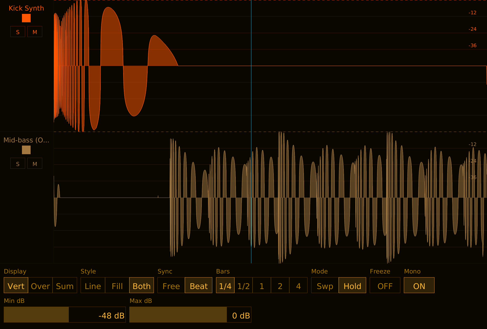

# Pope Scope Manual

## What is Pope Scope?

Pope Scope is a multichannel real-time oscilloscope with beat sync. Multiple instances share audio data through a global store, allowing one window to display waveforms from up to 16 tracks simultaneously. Each instance is a pass-through audio effect -- it captures waveform data without modifying the signal.

Features an amber phosphor terminal theme with CPU rendering.



## Installation

Build from source (requires nightly Rust):

```bash
cargo nih-plug bundle pope-scope --release
```

The bundler outputs to `target/bundled/`. Copy either the `.vst3` or `.clap` file to your plugin directory:

- **Linux**: `~/.vst3/` or `~/.clap/`
- **macOS**: `~/Library/Audio/Plug-Ins/VST3/` or `~/Library/Audio/Plug-Ins/CLAP/`
- **Windows**: `C:\Program Files\Common Files\VST3\` or `C:\Program Files\Common Files\CLAP\`

## Quick Start

1. Insert Pope Scope on one or more tracks
2. Open the GUI on any instance -- all active tracks are visible
3. Use **Display** to switch between Vertical (stacked), Overlay (superimposed), or Sum (mixed) views
4. Set **Sync** to Beat for bar-aligned waveforms, or Free for continuous scrolling
5. Use **Solo** (S) and **Mute** (M) on track control strips to isolate signals

## Controls

### Row 1

#### Display

Display mode selector. Three options:

- **Vert** (Vertical) -- each track gets its own horizontal strip, stacked top to bottom. Track separators and per-track amplitude grids. Best for comparing individual signals.
- **Over** (Overlay) -- all tracks superimposed in the same area, each in its own color. Shared amplitude grid. Best for seeing how signals relate in time.
- **Sum** -- all visible tracks mixed to a single waveform drawn in amber. Shared amplitude grid. Best for seeing the combined result.

Default: Vertical.

#### Style

Draw style selector. Three options:

- **Line** -- waveform drawn as a 1-pixel line.
- **Fill** -- waveform drawn as a filled region from the centerline.
- **Both** -- filled region with a line on top.

Default: Both.

#### Sync

Sync mode selector. Two options:

- **Free** -- continuous free-running display. The Timebase slider controls the visible time window (1 ms to 10 s). The display shows the most recent audio data.
- **Beat** -- beat-synchronized display. The waveform aligns to bar/beat boundaries from the DAW transport. The Unit selector controls the window size in bars. Requires the DAW to be playing and providing tempo/time signature information.

Default: Beat Sync.

#### Unit

Sync unit selector (only visible when Sync is set to Beat). Five options:

- **1/4** -- quarter bar
- **1/2** -- half bar
- **1** -- one bar
- **2** -- two bars
- **4** -- four bars

Default: 1 bar.

#### Freeze

Toggle button. When ON, the waveform display stops updating and holds the current frame. Useful for inspecting a specific moment in time.

Default: OFF.

#### Mono

Toggle button. When ON, stereo channels are mixed to mono for display. When OFF, the first channel (left) is displayed.

Default: ON.

### Row 2

#### Timebase

Horizontal slider (only visible when Sync is set to Free). Controls the visible time window.

Range: 1 ms to 10,000 ms (10 seconds). Default: 2,000 ms. The scale is logarithmic -- fine control at short timebases, coarser at long ones.

Drag horizontally to adjust. Hold **Shift** while dragging for fine control (10x slower). **Double-click** to reset to default.

#### Min dB

Horizontal slider. Sets the bottom of the visible amplitude range.

Range: -96 to -6 dB. Default: -48 dB. Signals below this level are not visible. Raising Min dB zooms in on louder signals; lowering it reveals quieter detail.

Drag horizontally to adjust. Hold **Shift** while dragging for fine control. **Double-click** to reset to default.

#### Max dB

Horizontal slider. Sets the top of the visible amplitude range.

Range: -48 to 0 dB. Default: 0 dB. Lowering Max dB zooms in on quieter signals by excluding the loudest peaks.

Drag horizontally to adjust. Hold **Shift** while dragging for fine control. **Double-click** to reset to default.

## Display Modes

### Vertical

Each track occupies a horizontal strip. Strips are stacked top to bottom in slot order. Each strip has its own amplitude grid and waveform. Track separators are drawn between strips. Grid time/beat labels appear on the bottom track only.

### Overlay

All visible tracks are drawn in the same area, superimposed on a shared amplitude grid. Each track uses its own color. Useful for comparing phase relationships or seeing how multiple signals align in time.

### Sum

All visible tracks are summed sample-by-sample into a single waveform, drawn in the default amber color. One shared amplitude grid. Shows the combined result of all active tracks.

## Draw Styles

### Line

Waveform rendered as a thin line tracing the amplitude contour. Minimal visual weight -- good for dense overlays where multiple tracks are visible.

### Filled

Waveform rendered as a filled region from the centerline (zero crossing) to the amplitude contour. Heavier visual weight -- good for seeing the energy distribution of a signal.

### Both

Filled region with a line on top. Combines the energy visibility of Filled with the precision of Line. This is the default.

## Beat Sync

When Sync is set to Beat, Pope Scope aligns the waveform display to musical time from the DAW transport.

The plugin reads tempo, time signature, and PPQ (pulses per quarter note) position from the host. The display window snaps to bar boundaries -- for example, with Unit set to 1 bar in 4/4 time, the display always shows exactly 4 beats starting on a downbeat.

A beat grid is drawn with lines at each beat position and thicker lines at bar boundaries. Beat numbers are labeled along the bottom.

**Requirements:** The DAW must be playing and providing transport information. When the transport is stopped, the beat sync display will show the last captured window.

**Discontinuity detection:** When the transport loops, seeks, or starts playing, Pope Scope detects the discontinuity and resets the display window to the new position.

## Multi-Instance

### How It Works

Pope Scope uses a static global store with 16 slots. Each instance acquires a slot when initialized and releases it when deactivated. All instances in the same host process share the same store.

Audio is pushed into per-slot ring buffers by each instance's process() callback. Any instance's GUI can read all slots and display all active tracks. This means you only need to open one instance's GUI to see every track.

### Track Groups

Each instance is assigned to a group (0-15) via the Group parameter. All instances in the same group are visible together. The group assignment is reflected in the slot metadata and used for filtering which tracks appear in the display.

### Solo and Mute

Each track has Solo (S) and Mute (M) buttons in the Vertical display mode's control strip:

- **Solo** -- when any track is soloed, only soloed tracks are visible. Multiple tracks can be soloed simultaneously.
- **Mute** -- muted tracks are hidden from the display. Mute takes priority over solo (a muted+soloed track is hidden).

Solo and mute are display-only -- they do not affect the audio signal.

### Color

Each track is assigned a color from a 16-color palette (amber, cyan, rose, yellow, orange, purple, red, blue, and their lighter variants). Colors are assigned automatically by slot index. Click the color swatch in the control strip to cycle to the next color.

## Mouse Cursor

When the mouse hovers over the waveform display area, a vertical cursor line is drawn at the mouse position. This helps identify the exact time/beat position of features in the waveform.

## Peak Hold

In Vertical display mode, a dashed horizontal line shows the peak amplitude for each track. The peak level holds for 2 seconds, then decays at 20 dB/s until it reaches -96 dB.

## Scaling

Use the **-** / **+** buttons in the upper right corner. Range: 75% to 300%. Scale is persisted across host restarts.

## Technical Notes

- **Pass-through audio** -- Pope Scope does not modify the audio signal. Input is passed directly to output.
- **No audio-thread allocations** -- the process() callback pushes samples into pre-allocated ring buffers using `try_lock()` to avoid blocking
- **CPU rendering** -- uses tiny-skia (software rasterizer) + fontdue (glyph cache) + softbuffer (pixel buffer). No OpenGL context, no GPU drivers loaded
- **SIMD ring buffer** -- two-pass push: bulk memcpy + f32x16 SIMD mipmap reduction. 3-level hierarchy (raw, 64-sample blocks, 256-sample blocks) for efficient rendering at any zoom
- **Atomic time mapping** -- PPQ/sample position mapping uses lock-free atomics with discontinuity detection for loop/seek/play-start events. Bar latch eliminates per-buffer PPQ jitter
- **Static global store** -- 16 slots with atomic CAS ownership. Ring buffers are allocated on demand when an instance joins and deallocated on leave
- **32-second ring buffer** -- each channel stores 32 seconds of audio at the current sample rate
- **Hold mode** -- double-buffered bar display with Arc front buffer for zero-copy reads. Shows last complete bar for phase alignment
- **DAW track names** -- receives track name/color from host via CLAP track-info extension
- **Embedded font** -- DejaVu Sans, compiled into the binary. No runtime font loading

Benchmarks (Bitwig, 48 kHz / 1024 samples, 16 instances, audio playing):

| Condition | CPU | RSS | Per Instance |
|---|---|---|---|
| GUI closed | 2% | 247 MB | 0.13% CPU, 15.4 MB |
| GUI open (large window) | 80% | 249 MB | 5% CPU, 15.6 MB |

GUI rendering cost is dominated by tiny-skia path rasterization and scales with window size × visible tracks × draw style. Audio thread overhead is minimal (~2% for 16 instances).

## Formats

- CLAP
- VST3
- Standalone (JACK or ALSA backend)

## License

GPL-3.0-or-later
