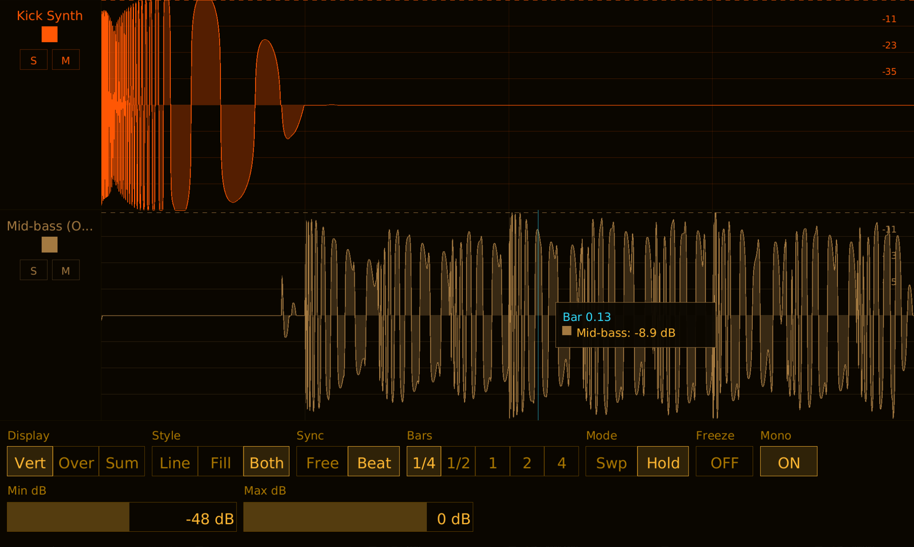

# Pope Scope Manual

## What is Pope Scope?

Pope Scope is a multichannel real-time oscilloscope with beat sync. Multiple instances share audio data through a global store, allowing one window to display waveforms from up to 16 tracks simultaneously. Each instance is a pass-through audio effect -- it captures waveform data without modifying the signal.

Features an amber phosphor terminal theme with CPU rendering.



## Installation

Build from source (requires nightly Rust):

```bash
cargo nih-plug bundle pope-scope --release
```

The bundler outputs to `target/bundled/`. Copy either the `.vst3` or `.clap` file to your plugin directory:

- **Linux**: `~/.vst3/` or `~/.clap/`
- **macOS**: `~/Library/Audio/Plug-Ins/VST3/` or `~/Library/Audio/Plug-Ins/CLAP/`
- **Windows**: `C:\Program Files\Common Files\VST3\` or `C:\Program Files\Common Files\CLAP\`

## Quick Start

1. Insert Pope Scope on one or more tracks
2. Open the GUI on any instance -- all active tracks are visible
3. Use **Display** to switch between Vertical (stacked), Overlay (superimposed), or Sum (mixed) views
4. Set **Sync** to Beat for bar-aligned waveforms, or Free for continuous scrolling
5. Use **Solo** (S) and **Mute** (M) on track control strips to isolate signals
6. Hover the waveform to see a vertical cursor line and a popup tooltip with the time/bar position and per-track dB readings at that point

## Controls

### Row 1

#### Display

Display mode selector. Three options:

- **Vert** (Vertical) -- each track gets its own horizontal strip, stacked top to bottom. Track separators and per-track amplitude grids. Best for comparing individual signals.
- **Over** (Overlay) -- all tracks superimposed in the same area, each in its own color. Shared amplitude grid. Best for seeing how signals relate in time.
- **Sum** -- all visible tracks mixed to a single waveform drawn in amber. Shared amplitude grid. Best for seeing the combined result.

Default: Vertical.

#### Style

Draw style selector. Three options:

- **Line** -- waveform drawn as a 1-pixel line.
- **Fill** -- waveform drawn as a filled region from the centerline.
- **Both** -- filled region with a line on top.

Default: Both.

#### Sync

Sync mode selector. Two options:

- **Free** -- continuous free-running display. The Timebase slider controls the visible time window (1 ms to 10 s). The display shows the most recent audio data.
- **Beat** -- beat-synchronized display. The waveform aligns to bar/beat boundaries from the DAW transport. The Unit selector controls the window size in bars. Requires the DAW to be playing and providing tempo/time signature information.

Default: Beat Sync.

#### Bars

Bar length selector (only visible when Sync is set to Beat). Five options:

- **1/4** -- quarter bar
- **1/2** -- half bar
- **1** -- one bar
- **2** -- two bars
- **4** -- four bars

Default: 1 bar.

#### Mode

Display mode for beat sync (only visible when Sync is set to Beat). Two options:

- **Swp** (Sweep) -- waveform fills left to right as the bar plays, resets at bar boundary. Shows real-time playback position.
- **Hold** -- shows the last complete bar. Updates atomically at each bar boundary. Best for phase alignment and comparing waveform shapes across tracks.

Default: Sweep.

#### Freeze

Toggle button. When ON, the waveform display stops updating and holds the current frame. Useful for inspecting a specific moment in time.

Default: OFF.

#### Mono

Toggle button. When ON, stereo channels are mixed to mono for display. When OFF, all channels are drawn individually with hue-shifted colors (e.g., L in the track's base color, R shifted +30 degrees).

Default: ON.

### Row 2

#### Timebase

Horizontal slider (only visible when Sync is set to Free). Controls the visible time window.

Range: 1 ms to 10,000 ms (10 seconds). Default: 2,000 ms. The scale is logarithmic -- fine control at short timebases, coarser at long ones.

Drag vertically to adjust. Hold **Shift** while dragging for fine control (10x slower). **Double-click** to reset to default.

#### Min dB

Horizontal slider. Sets the bottom of the visible amplitude range.

Range: -96 to -6 dB. Default: -48 dB. Signals below this level are not visible. Raising Min dB zooms in on louder signals; lowering it reveals quieter detail.

Drag vertically to adjust. Hold **Shift** while dragging for fine control. **Double-click** to reset to default.

#### Max dB

Horizontal slider. Sets the top of the visible amplitude range.

Range: -48 to +12 dB. Default: 0 dB. Lowering Max dB zooms in on quieter signals by excluding the loudest peaks. Values above 0 dB show clipping headroom.

Drag vertically to adjust. Hold **Shift** while dragging for fine control. **Double-click** to reset to default.

## Display Modes

### Vertical

Each track occupies a horizontal strip. Strips are stacked top to bottom in slot order. Each strip has its own amplitude grid and waveform. Track separators are drawn between strips. Grid time/beat labels appear on the bottom track only.

### Overlay

All visible tracks are drawn in the same area, superimposed on a shared amplitude grid. Each track uses its own color. Useful for comparing phase relationships or seeing how multiple signals align in time.

### Sum

All visible tracks are summed sample-by-sample into a single waveform, drawn in the default amber color. One shared amplitude grid. Shows the combined result of all active tracks.

## Draw Styles

### Line

Waveform rendered as a thin line tracing the amplitude contour. Minimal visual weight -- good for dense overlays where multiple tracks are visible.

### Filled

Waveform rendered as a filled region from the centerline (zero crossing) to the amplitude contour. Heavier visual weight -- good for seeing the energy distribution of a signal.

### Both

Filled region with a line on top. Combines the energy visibility of Filled with the precision of Line. This is the default.

## Beat Sync

When Sync is set to Beat, Pope Scope aligns the waveform display to musical time from the DAW transport.

The plugin reads tempo, time signature, and PPQ (pulses per quarter note) position from the host. The display window snaps to bar boundaries -- for example, with Unit set to 1 bar in 4/4 time, the display always shows exactly 4 beats starting on a downbeat.

A beat grid is drawn with lines at each beat position and thicker lines at bar boundaries. Beat numbers are labeled along the bottom.

**Requirements:** The DAW must be playing and providing transport information. When the transport is stopped, the beat sync display will show the last captured window.

**Discontinuity detection:** When the transport loops, seeks, or starts playing, Pope Scope detects the discontinuity and resets the display window to the new position.

## Multi-Instance

### How It Works

Pope Scope uses a static global store with 16 slots. Each instance acquires a slot when initialized and releases it when deactivated. All instances in the same host process share the same store.

Audio is pushed into per-slot ring buffers by each instance's process() callback. Any instance's GUI can read all slots and display all active tracks. This means you only need to open one instance's GUI to see every track.

### Track Groups

Each instance is assigned to a group (0-15) via the Group parameter. All instances in the same group are visible together. The group assignment is reflected in the slot metadata and used for filtering which tracks appear in the display.

### Solo and Mute

Each track has Solo (S) and Mute (M) buttons in the Vertical display mode's control strip:

- **Solo** -- when any track is soloed, only soloed tracks are visible. Multiple tracks can be soloed simultaneously.
- **Mute** -- muted tracks have their waveform hidden but keep their lane and control strip visible (so you can unmute). Solo overrides mute — a soloed track is always visible.

Solo and mute are display-only -- they do not affect the audio signal.

### Track Names

Track names are received from the host via the CLAP track-info extension. Long names are truncated with an ellipsis — hover over a truncated name to see the full text in a tooltip. If the host doesn't provide a name, "Track N" is shown.

### Color

Each track is assigned a color from a 16-color palette (amber, cyan, rose, yellow, orange, purple, red, blue, and their lighter variants). Colors are assigned automatically by slot index. The host can also provide a track color via CLAP track-info. Click the color swatch in the control strip to cycle to the next color. Grid lines and dB labels in each track's lane match the track color.

## Cursor Tooltip

When the mouse hovers over the waveform display area, Pope Scope draws a vertical cursor line at the mouse position and a small popup tooltip anchored to it. The tooltip has two parts:

- **Time header** -- the time at the cursor's x position. In **Free** mode this is `X.X ms` or `XXX us` for sub-millisecond timebases, counted from the left edge of the visible window. In **Beat Sync** mode it reads `Bar X.XX`, the fractional bar position within the visible window (matches the grid's bar labels).
- **Per-track rows** -- one row per track whose waveform is visible, each showing a small color swatch in the track's color and a `Name: -X.X dB` reading. Muted (and non-soloed) tracks are hidden from the tooltip, matching what's drawn on screen. If the host doesn't report a track name the label falls back to `Slot N`. `-inf dB` is shown for silence.

The dB value is sampled from the same pixel column the renderer uses, so the number in the tooltip always matches the visible envelope peak at the cursor -- including at decimated mipmap zoom levels where a single pixel column covers many underlying samples.

**Position.** The tooltip is anchored to the right of the cursor by default. It auto-flips to the left if it would run off the right edge and clamps vertically to stay inside the waveform area (it won't overlap the control bar or control strips).

**Outline color.** When the tooltip shows a single track (always the case in Vertical mode, and in Overlay/Sum mode when only one track is visible) the tooltip's outline matches that track's color. With multiple tracks the outline uses the amber foreground color.

**Vertical mode behavior.** In Vertical display mode the cursor line and tooltip restrict to the single lane the mouse is actually over -- the cursor line only spans that lane's height, and the tooltip reports only that lane's reading. Hovering a muted lane produces no tooltip. In Overlay and Sum modes the cursor spans the full waveform height and the tooltip lists every visible track.

**Frozen view.** When **Freeze** is on, the tooltip's time/bar label and the grid both read from the view parameters that were in effect when the frozen snapshot was captured. Editing timebase or sync mode while frozen won't desync the labels from the frozen waveform -- the visible view stays internally consistent until you unfreeze.

## Peak Hold

In Vertical display mode, a dashed horizontal line shows the peak amplitude for each track. The peak level holds for 2 seconds, then decays at 20 dB/s until it reaches -96 dB.

## Window Resizing

Drag the window edges to resize (host-initiated resize via CLAP/VST3). The display scales proportionally. Window size is persisted across host restarts. Keyboard shortcuts **Ctrl+=** and **Ctrl+-** also work.

## Technical Notes

- **Pass-through audio** -- Pope Scope does not modify the audio signal. Input is passed directly to output.
- **No audio-thread allocations** -- the process() callback pushes samples into pre-allocated ring buffers using `try_lock()` to avoid blocking
- **CPU rendering** -- uses tiny-skia (software rasterizer) + fontdue (glyph cache) + softbuffer (pixel buffer). No OpenGL context, no GPU drivers loaded
- **Direct pixel-write waveform path** -- the dense-samples branches of `draw_waveform_line` and `draw_waveform_filled` bypass tiny-skia's raster pipeline entirely. Each pixel column is a single 1-pixel-wide strip written directly into the pixmap's backing buffer, with the color pre-flattened to `PremultipliedColorU8` once per draw. No `Paint`, no anti-aliased blit, no per-pixel source-over blend. The envelope contour uses a half-split smoothing rule (`min(own_top, (prev + own)/2, (own + next)/2)` and the symmetric `max` for the bottom) to avoid visible staircase steps without re-introducing rasterization cost. Profile measurements on a 2-track cursor-motion scenario in Bitwig showed a ~52% reduction in GUI CPU versus the original path-based renderer
- **Cursor tooltip `peak_at_column`** -- the per-track dB readings in the cursor tooltip use `WaveSnapshot::peak_at_column(col, num_cols, mix_to_mono)`, which samples the buffer over the exact range of underlying samples the renderer assigns to that pixel column. Uses integer `div_ceil` arithmetic that mirrors tiny-skia's floor-based decimation. In the sparse-samples branch (fewer samples than pixel columns) it linearly interpolates between the two adjacent samples bracketing the cursor's fractional position. This guarantees the tooltip's reported dB matches the envelope peak visible at the cursor, even at decimated zoom levels where a single column covers dozens of samples
- **SIMD ring buffer** -- two-pass push: bulk memcpy + f32x16 SIMD mipmap reduction. 3-level hierarchy (raw, 64-sample blocks, 256-sample blocks) for efficient rendering at any zoom
- **Atomic time mapping** -- PPQ/sample position mapping uses lock-free atomics with discontinuity detection for loop/seek/play-start events. Bar latch eliminates per-buffer PPQ jitter
- **Static global store** -- 16 slots with atomic CAS ownership. Ring buffers are allocated on demand when an instance joins and deallocated on leave
- **32-second ring buffer** -- each channel stores 32 seconds of audio at the current sample rate
- **Hold mode** -- double-buffered bar display with Arc front buffer for zero-copy reads. Shows last complete bar for phase alignment
- **Frozen view consistency** -- when Freeze is on, the view parameters (`sync_mode`, `timebase`, `sync_unit`) are cached from the frame that built the snapshot. The grid rendering and cursor tooltip both read from the cache while frozen, so editing live parameters while frozen can't desync the visible grid or tooltip labels from the frozen waveform
- **DAW track names** -- receives track name/color from host via CLAP track-info extension
- **Embedded font** -- DejaVu Sans, compiled into the binary. No runtime font loading

Benchmarks (Bitwig, 48 kHz / 1024 samples, 16 instances, audio playing):

| Condition | CPU | RSS | Per Instance |
|---|---|---|---|
| GUI closed | 2% | 247 MB | 0.13% CPU, 15.4 MB |

The GUI-open number from earlier revisions (80% CPU for 16 instances with a large window) is outdated -- the waveform renderer has been rewritten as described above and the dominant cost with the GUI open is no longer waveform rasterization. Remaining draw-thread cost is split between softbuffer's window blit and the background pixmap clear; both scale with window area and are memory-bandwidth bound. Audio thread overhead is minimal (~2% for 16 instances, unchanged).

## Formats

- CLAP
- VST3
- Standalone (JACK or ALSA backend)

## License

GPL-3.0-or-later
