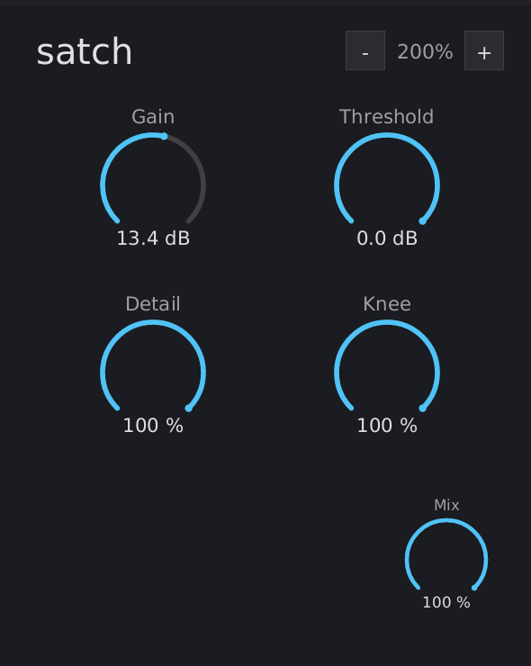

# satch Manual

{ width=50% }

## What is satch?

satch is a detail-preserving spectral saturator. It uses FFT-based spectral analysis to preserve quiet frequency components (detail) through the clipping process, producing textured flat-top clipping instead of the smooth, featureless flat tops of standard time-domain saturation.

Inspired by Newfangled Audio's Saturate.

## Installation

Build from source (requires nightly Rust):

```bash
cargo nih-plug bundle satch --release
```

The bundler outputs to `target/bundled/`. Copy either the `.vst3` or `.clap` file to your plugin directory:

- **Linux**: `~/.vst3/` or `~/.clap/`
- **macOS**: `~/Library/Audio/Plug-Ins/VST3/` or `~/Library/Audio/Plug-Ins/CLAP/`
- **Windows**: `C:\Program Files\Common Files\VST3\` or `C:\Program Files\Common Files\CLAP\`

## Quick Start

1. Insert satch on a track
2. Raise **Gain** to push the signal into clipping
3. Turn up **Detail** to preserve quiet harmonics through the clipped sections
4. Adjust **Knee** to taste (0% = hard clip, 100% = soft tanh)

## Controls

### Row 1: Level

#### Gain

Input gain boost. Range: 0 to +24 dB. Default: 0 dB.

Pushes the signal toward the clip ceiling. Higher gain = more of the signal exceeds the threshold and gets clipped. At 0 dB, the signal passes through at its original level (clipping only occurs if it already exceeds the threshold).

#### Threshold

Clip ceiling. Range: -24 to 0 dB. Default: 0 dB.

Sets where clipping begins. At 0 dB, the ceiling is at full scale (±1.0). At -6 dB, the ceiling drops to ±0.5 -- any signal above that level is clipped. Below the threshold, the signal passes through unchanged.

Threshold is independent of Gain. Gain controls how hard the signal hits the ceiling; Threshold controls where the ceiling is.

### Row 2: Character

#### Detail

Spectral detail preservation. Range: 0 to 100%. Default: 0%.

Controls how much quiet spectral content survives through the clipping process.

- **0%**: Standard time-domain saturation. Flat tops are smooth and featureless -- all frequency content in the clipped region is destroyed.
- **100%**: Full spectral detail preservation. Quiet harmonics ride through the clipped sections as visible texture on the flat tops. The peaks stay at the clip level; the texture hangs downward.

Detail only affects clipped portions of the signal. Unclipped material is identical at 0% and 100%.

The spectral analysis uses a 2048-point FFT with 75% overlap (512-sample hop), introducing 2048 samples of latency (compensated automatically by the host).

#### Knee

Clipping shape. Range: 0 to 100%. Default: 100%.

Controls the transition from linear to clipped:

- **0% (hard)**: Brick-wall clipping. The signal passes through linearly below the threshold and is hard-clamped at the threshold. Sharp transition, maximum edge.
- **100% (soft)**: Tanh saturation curve. Gradual transition into clipping -- signals approaching the threshold are gently compressed before reaching the ceiling. Warmer, rounder character.
- **In between**: Linear crossfade between hard and soft.

### Bottom Right

#### Mix

Dry/wet blend. Range: 0 to 100%. Default: 100%.

At 100%, the output is fully processed. At 0%, the output is the original dry signal (delayed to match latency). Use intermediate values for parallel saturation.

## How It Works

satch combines two clipping paths:

1. **Time-domain path**: Applies `threshold * tanh(gain * x / threshold)` (crossfaded with a hard clip via the knee) to produce flat-top clipping at the threshold level.

2. **Spectral path**: Uses an STFT (Short-Time Fourier Transform) to split each frame's bins into a *loud* path (bins within 6 dB of the spectral peak) and a *quiet* path (bins more than 20 dB below it, smoothly crossfaded between). The two paths are reconstructed by **separate inverse STFTs**; the nonlinear clipping is applied in the **time domain after reconstruction** (not per-bin in the frequency domain), which keeps the overlap-add normalization exact. The result has flat-top clipping character but with the quiet detail preserved.

The **Detail** knob blends between the two paths, but only in clipped regions. A clip-aware mask (`tanh^2(gain * x / threshold)`) detects where clipping is occurring and applies the spectral difference only there. Unclipped material always uses the time-domain path.

The output is safety-clamped at ±threshold × 1.5 -- detail texture can ride up to 50% above the threshold clip level rather than being limited exactly at it.

## Scaling

The window is freely resizable -- drag the plugin window's edge or corner in your host. (There are no in-plugin zoom buttons or keyboard shortcuts.) The scale tracks the window width and clamps to 0.5x-4.0x (50% - 400%); the chosen size is persisted across host restarts.

## Interaction

- **Drag vertically** on any dial to adjust (up = increase)
- **Shift+drag** for fine control (10x slower)
- **Double-click** any dial to reset to default
- **Right-click** any dial to type a value; **Enter** commits, **Escape** cancels, clicking outside auto-commits

## Technical Notes

- **No audio-thread allocations** -- the process() callback never allocates heap memory in release builds
- **CPU rendering** -- uses tiny-skia (software rasterizer) + fontdue (glyph cache) + softbuffer (pixel buffer). No OpenGL context, no GPU drivers loaded
- **Time-domain nonlinearity** -- the tanh clipping is applied to the reconstructed signal in the time domain (after the two inverse STFTs), *not* per-bin in the frequency domain; this keeps the overlap-add COLA normalization exact. Quiet bins (detail) pass through while the loud fundamental is clipped
- **Clip-aware detail blend** -- `tanh^2` mask ensures spectral detail is only applied where the signal is actually being clipped, leaving unclipped material identical to the time-domain path
- **Peak-relative spectral split** -- bins within 6 dB of the spectral peak are classified as "loud"; bins more than 20 dB below are "quiet"; smooth crossfade in between

Benchmarks (Bitwig, 48 kHz / 1024 samples, GUI closed):

| Instances | CPU | RSS | Per Instance |
|---|---|---|---|
| 100 | 13.7% | 82 MB | ~0.82 MB, 0.14% CPU |

## Formats

- CLAP
- VST3
- Standalone (JACK, or CPAL -- ALSA on Linux, CoreAudio on macOS, WASAPI on Windows -- with a dummy/offline fallback)

## License

GPL-3.0-or-later
