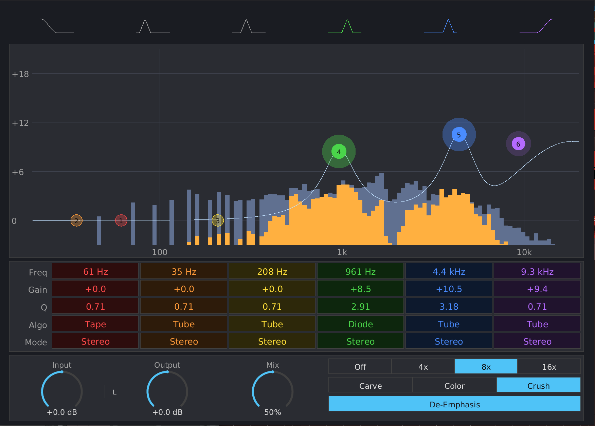

# Six Pack Manual

{ width=80% }

## What is Six Pack?

Six Pack is a six-band parallel multiband saturator. Unlike a conventional multiband distortion, it does not saturate the audio directly — it computes the difference between an EQ-boosted version of the dry signal and the dry signal itself, then runs only that *difference* through a saturation algorithm. A band at 0 dB gain produces zero difference and is silent; per-band gain effectively controls how hard each band is driven into the saturator.

Six bands of 1 low-shelf + 4 peaks + 1 high-shelf, six saturation algorithms, per-band Stereo / Mid / Side routing, four oversampling tiers, and a global de-emphasis toggle that subtracts the linear EQ boost so only the saturator's harmonics are audible.

Inspired by Wavesfactory Spectre.

## Installation

Build from source (requires nightly Rust):

```bash
cargo nih-plug bundle six-pack --release
```

The bundler outputs to `target/bundled/`. Copy either the `.vst3` or `.clap` file to your plugin directory:

- **Linux**: `~/.vst3/` or `~/.clap/`
- **macOS**: `~/Library/Audio/Plug-Ins/VST3/` or `~/Library/Audio/Plug-Ins/CLAP/`
- **Windows**: `C:\Program Files\Common Files\VST3\` or `C:\Program Files\Common Files\CLAP\`

A standalone build is also available: `cargo build --bin six-pack --release` produces `target/release/six-pack`, which connects to JACK on Linux and CoreAudio / WASAPI on macOS / Windows.

## Quick Start

1. Insert Six Pack on a track.
2. Drag any band's dot upward to boost that frequency band — you'll see the dot light up with a halo and orange "harmonics added" content appear in the spectrum overlay where the boost is.
3. Try the saturation algorithms (the **Algo** row of the band labels) to hear different harmonic characters.
4. With **De-Emphasis** on (default), the band's EQ shape is canceled and you hear only the saturation harmonics. Turn it off to hear the EQ boost as well.
5. Use **Drive** to switch between **Carve / Color / Crush** for three different effect *characters* (see Drive section).

## The Display

The main view spans most of the window:

- **Filter icons** along the top: a low-shelf icon, four peak icons, and a high-shelf icon. Click any icon to toggle that band on or off.
- **EQ curve view** below the icons: log-frequency axis (20 Hz – 20 kHz) horizontal, dB axis (0 → +18 dB) vertical. The composite EQ response of all enabled bands is drawn as a cyan line.
- **Faded blue spectrum** behind the curve: the input signal's spectrum (post input-gain).
- **Bright orange overlay** on top: the *wet* path's spectrum — i.e., what Six Pack is adding to the signal. At low drive this is subtle; at higher drive it lights up the bands you've boosted.
- **Six color-coded dots** on the curve: one per band, in rainbow order (red → orange → yellow → green → blue → violet, low to high frequency). Each dot's halo brightens and inflates with the band's current saturation activity.
- **Per-band labels grid** below the curve: five rows x six columns showing each band's frequency, gain, Q, algorithm, and channel mode. Each cell is tinted with the band's color and the values are rendered in the band's color so it's easy to track which column belongs to which dot.
- **Bottom strip**: Input gain, I/O Link button, Output gain, Mix dial, plus Quality / Drive / De-Emphasis selectors.

## Per-Band Controls

Each of the six bands has six parameters, exposed both via the dot and via the labels grid.

### Frequency (Freq)

Range: 20 Hz – 20 kHz, log-skewed. Defaults: 60 Hz, 180 Hz, 540 Hz, 1.6 kHz, 4.8 kHz, 12 kHz.

Drag the dot horizontally, or right-click the **Freq** label to type a value. Bands 1 (low-shelf) and 6 (high-shelf) use shelving filter shapes; the four middle bands are peaks.

### Gain

Range: 0 to +18 dB, linear. Default: 0 dB.

**Boost-only** — gain cannot go negative. At 0 dB the band produces zero difference (the SVF is analytically unity) and contributes silence regardless of the algorithm or drive. The `boost = EQ(dry) − dry` is the load-bearing signal that goes into the saturator. Higher gain → larger diff → harder saturator drive → more harmonics.

Drag the dot vertically or right-click the **Gain** label to type a value.

### Q

Range: 0.1 to 30, log-skewed. Default: 0.71.

Controls the bandwidth of the filter:

- **Peak bands**: Q = 1/bandwidth. Q approximately  0.71 is a broad bell (~1.4 octaves wide); Q = 10 is fairly narrow (~0.14 octaves); Q = 30 is needle-like (~5% of center frequency, surgical).
- **Shelf bands**: Q controls the resonance at the corner frequency. Q = 0.71 is a clean Butterworth-like transition; higher Q adds a peak/dip wiggle at the corner.

Scroll-wheel over a dot to adjust, or right-click the **Q** label to type a value.

All bands are 2nd-order (12 dB/oct underlying slope). This is fixed — going to higher orders would break the analytic-unity-at-0-dB property the diff-trick depends on. If you need very steep transitions, stack multiple bands at the same frequency.

### Algorithm (Algo)

Six pure-function waveshapers, applied to the post-routed boost signal. Each has its own harmonic signature.

- **Tube**: symmetric tanh-style soft clip. Versatile, the default. Generates odd harmonics smoothly.
- **Tape**: asymmetric soft clip with bias. Punchier, naturally rolls off highs. Good for bass and kick, less suitable for high frequencies.
- **Diode**: symmetric soft clip with extra high-frequency content. Similar to tube but brighter, generates more odd harmonics.
- **Digital**: hard clip at ±1. Brittle, classic digital distortion.
- **Class B**: crossover distortion — symmetric soft clip with a small dead zone near zero. Adds harmonics on transients; suits drums and percussion.
- **Wavefold**: west-coast wavefolder. Signals exceeding ±1 fold back instead of clipping, generating dense odd+even harmonic content. Sonically distinct from any clipping algorithm; excellent for metallic, ringing, or aggressive textures. Pre-clipped to ±64 internally so it stays bounded at extreme drive.

Click the **Algo** label cell to cycle to the next algorithm.

### Channel Mode (Mode)

Three options: **Stereo / Mid / Side**.

- **Stereo**: the band's saturation runs independently on the left and right channels. Default.
- **Mid**: the band's diff is collapsed to its mid component (`(L + R) / 2`) before saturation, then re-emitted equally on L and R. Good for adding center-channel weight.
- **Side**: the band's diff is collapsed to its side component (`(L − R) / 2`) before saturation, then re-emitted with opposite signs on L and R. Saturating only the side gives a natural stereo widening on a full mix — try a high-shelf side-mode boost for "air".

The M/S routing happens *before* the saturator (the SVFs themselves run on L/R per-channel for state continuity). Because of that, "Side" mode actually saturates the side signal — not the residue of two L/R saturator outputs.

Click the **Mode** label cell to cycle to the next mode.

### Enable

Each band can be toggled on or off independently. Click the band's filter icon at the top of the window, or double-click its dot, to toggle. Disabled bands have a faded dot and contribute nothing to the wet path.

## Global Controls

The bottom strip has six global parameters.

### Input

Range: -24 to +24 dB. Default: 0 dB.

Pre-saturation gain applied at native rate. Pushing input harder makes every band's diff larger (because the SVF is unity-gain in dB but the filter coefficients amplify the input to the boosted level), and therefore drives the saturator harder.

### Output

Range: -24 to +24 dB. Default: 0 dB.

Post-saturation gain applied after the downsampler. Useful for compensating when high drive pushes the wet path loud.

### I/O Link

When enabled, **Output** is automatically slaved to `-Input` (in dB), keeping perceived loudness constant as you push input harder. The Output dial becomes display-only while the link is active. Same workflow as Spectre's link toggle.

### Mix

Range: 0% to 100%. Default: 50%.

Spectre-style two-stage mix curve:

- **0% mix**: pure dry signal, no harmonics audible.
- **50% mix**: dry at full level + wet (saturation harmonics) at full level. The default; both contribute fully.
- **100% mix**: dry is gone; only the wet path is heard. Useful for auditioning what Six Pack is generating.

The curve is piecewise:
```
dry_amp(m) = clamp(2 * (1 - m), 0, 1)   # = 1 from 0–50%, ramps 1 -> 0 over 50–100%
wet_amp(m) = clamp(2 * m,       0, 1)   # = 0 -> 1 over 0–50%, then = 1 from 50–100%
```

This means dragging Mix from 50% upward fades dry out while the wet stays at full level — a "solo the saturation" gesture.

### Quality

Four-tier oversampling selector: **Off / 4x / 8x / 16x**. Default: Off.

Six Pack's filters and saturators run at the host sample rate by default. At higher Quality settings, the audio is upsampled by the chosen factor, processed at that rate, and downsampled back. Higher oversampling reduces aliasing artifacts from the saturator's harmonic generation and gives more accurate filter shapes near Nyquist. Cost: CPU scales roughly linearly with the oversampling factor.

For mastering and clean character work, **4x** is usually plenty. **16x** is for surgical/transparent work where any aliasing is unacceptable.

Quality changes report new latency to the host. CLAP hosts handle this glitch-free; some VST3 hosts may produce a brief pop during the host's PDC re-resolve.

### Drive

Three-step character selector: **Carve / Color / Crush**. Default: Color.

This is the most subtle control to understand — the three settings are *not* three intensities of the same effect. They produce structurally different effects when De-Emphasis is on (which is the default).

- **Carve** (`k = 0.6`): the saturator's linear-domain contribution is below the EQ boost. The de-emph subtract over-cancels, leaving a phase-inverted residue that *carves a notch* in the band's frequency range, plus quiet harmonics. Use this for subtractive shaping — it sounds like dipping the band rather than boosting it, with character on top.
- **Color** (`k = 1.0`): the saturator's linear contribution exactly matches the boost. The de-emph subtract zeroes it out, leaving only the saturator's harmonics — pure tonal coloring with no audible EQ shape.
- **Crush** (`k = 2.0`): the saturator's linear contribution exceeds the boost. The de-emph subtract under-cancels, so the EQ boost stays in *plus* loud harmonics ride on top. Aggressive, additive character.

If De-Emphasis is **off**, all three drives become straightforward intensity steps — Carve is gentlest, Color is medium, Crush is most distorted.

### De-Emphasis

Boolean toggle. Default: **on**.

When on, Six Pack subtracts the linear EQ boost (`Σ boost_b`) from the wet path before mixing. The effect:

- The EQ shape itself is *not* audible — only the saturator's harmonics.
- The "where in the spectrum to add harmonics" intuition for the band gain knobs holds: a +12 dB band creates noticeable harmonics around its center frequency; a +0 dB band generates nothing.
- Combined with the Drive character ladder, you can dial Carve / Color / Crush to choose between subtractive, neutral, and additive character per the description above.

When off, the wet path includes both the EQ boost and the harmonics, so you get a more conventional "boost + saturate" sound. Useful when you actually want the EQ shape to be audible alongside the saturation.

## How It Works

### The diff-trick

Each band runs a state-variable filter on the dry input and computes:

```
diff = SVF(dry) - dry
```

At gain = 0 dB the SVF is analytically unity (its gain coefficient is exactly zero), so `diff = 0`. At higher gains, `diff` is the time-domain signal that contains *only* the EQ-boosted spectral content. This signal, scaled by the global drive multiplier, is the saturator's input.

Because the diff is zero when the band is flat, a band at 0 dB contributes silence regardless of which algorithm or drive setting is active. Boost-only gain isn't a UI restriction — it's required by the math.

### Per-band signal flow

For each band:

```
diff_L = SVF_L(dry_L) - dry_L
diff_R = SVF_R(dry_R) - dry_R

match channel_mode:
    Stereo: sat_L = saturate(diff_L * drive_k)
            sat_R = saturate(diff_R * drive_k)
    Mid:    m_diff = (diff_L + diff_R) / 2
            m_sat  = saturate(m_diff * drive_k)
            sat_L  = sat_R = m_sat
    Side:   s_diff = (diff_L - diff_R) / 2
            s_sat  = saturate(s_diff * drive_k)
            sat_L  =  s_sat
            sat_R  = -s_sat
```

The SVFs run on L/R per-channel so their state stays coherent across mode changes. Because SVF is linear, the diff can be safely routed to M/S *before* saturation. This means "Side" mode actually saturates the side signal — not the residue of two L/R saturator outputs.

### Mix and de-emphasis

```
wet_L = Σ_b sat_L_b
wet_R = Σ_b sat_R_b

if de_emph:
    wet_L -= Σ_b boost_L_b
    wet_R -= Σ_b boost_R_b

output_L = dry_amp(mix) * dry_L + wet_amp(mix) * wet_L
output_R = dry_amp(mix) * dry_R + wet_amp(mix) * wet_R
```

The de-emph subtract uses the *unscaled* boost (not `drive_k * boost`). This is what makes Carve/Color/Crush produce three structurally different effects rather than three intensities of the same effect.

## Interaction

- **Drag** a band dot horizontally to change Frequency, vertically to change Gain.
- **Shift+drag** for fine control (the drag becomes ~10x slower).
- **Scroll wheel** on a dot adjusts Q.
- **Double-click** a dot to toggle the band's Enable state.
- **Click** any filter icon at the top of the window to toggle that band's Enable.
- **Click** an Algo or Mode label cell to cycle to the next option.
- **Right-click** a dial or any numeric label cell (Freq / Gain / Q) to type a value. **Enter** commits, **Escape** cancels, clicking outside auto-commits.
- The window is **freely resizable** — drag the bottom-right corner. Size persists with the host session.

## Visual Feedback

- **Spectrum overlay** (faded blue): input signal spectrum.
- **Wet overlay** (bright orange): the saturator's output spectrum — what Six Pack is adding. At low drive this is subtle; at higher drive it shows clearly which bands are working.
- **Band-dot halo**: each dot's halo brightens and inflates with that band's current post-saturation RMS. Disabled bands don't glow.

The wet overlay's resolution is approximately 6% per bin (128 log-spaced bins from 20 Hz to 20 kHz). Above Q approximately  16, narrow needles collapse to a single tall bar in the visualization, but the audio is fully accurate.

## Technical Notes

- **No audio-thread allocations.** The `process()` callback never allocates heap memory. Oversampling scratch is pre-sized to handle hosts up to 16384-sample buffers and any oversampling factor.
- **Boost-only is a math requirement, not a restriction.** The diff = SVF(dry) - dry pattern only produces a useful saturation signal when the SVF is unity-or-greater. A "cut" band would produce a phase-inverted diff that wouldn't behave like an EQ cut after going through the saturator.
- **TPT SVF in mix-form.** The peak filter computes `dry + (peak_gain − 1) · k · bandpass` where `k = 1/Q`; the `k` factor gives Q-independent peak magnitude. At gain = 0 dB the `(peak_gain − 1)` term is zero, so the filter is structurally unity (not just numerically close).
- **CPU rendering.** Uses tiny-skia (software rasterizer) + fontdue (glyph cache) + softbuffer (pixel buffer). No OpenGL context, no GPU drivers loaded.
- **Lock-free GUI ↔ audio communication.** Spectrum bins (input and wet) are stored as `[AtomicU32; 128]` (f32 bit pattern). Per-band activity is stored as `[AtomicU32; 6]`. The audio thread writes; the GUI thread reads with `Relaxed` ordering.
- **Linear-phase polyphase oversampling.** Cascaded half-band stages (Hamming-windowed sinc), so transients stay symmetric and the EQ curves keep their shape near Nyquist.

## Formats

- CLAP
- VST3
- Standalone (JACK on Linux; CoreAudio on macOS; WASAPI on Windows)

## License

GPL-3.0-or-later
