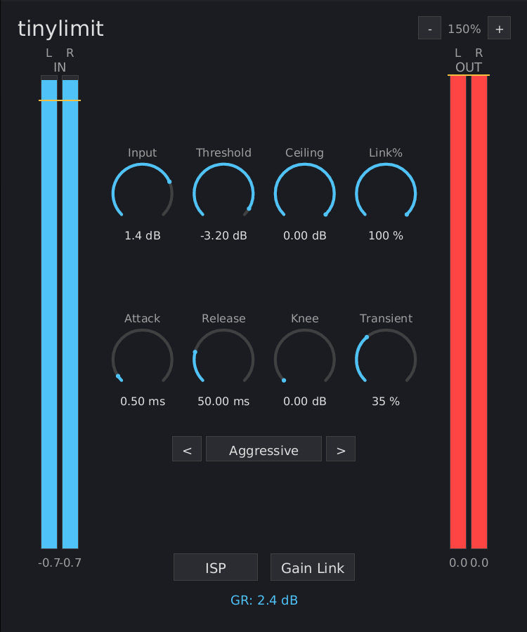

# tinylimit Manual

{ width=50% }

## What is tinylimit?

tinylimit is a low-latency wideband peak limiter for track-level use. It uses a feed-forward architecture with lookahead, dual-stage transient/dynamics handling, and optional true peak (ISP) targeting.

Inspired by DMG Audio's TrackLimit.

## Installation

Build from source (requires nightly Rust):

```bash
cargo nih-plug bundle tinylimit --release
```

The bundler outputs to `target/bundled/`. Copy either the `.vst3` or `.clap` file (you only need one -- use whichever your DAW supports) to your plugin directory:

- **Linux**: `~/.vst3/` or `~/.clap/`
- **macOS**: `~/Library/Audio/Plug-Ins/VST3/` or `~/Library/Audio/Plug-Ins/CLAP/`
- **Windows**: `C:\Program Files\Common Files\VST3\` or `C:\Program Files\Common Files\CLAP\`

## Quick Start

1. Insert tinylimit on a track
2. Lower the **Threshold** to push the signal into the limiter. The GR readout shows how much limiting is being applied.
3. Set **Ceiling** to your desired output maximum (e.g., -0.1 dB for CD, -1.0 dBTP for streaming)
4. Adjust character controls (Attack, Release, Knee, Transient) to taste, or click a **preset** name to start from a known setting

## Controls

### Signal Flow (Row 1)

#### Input

Pre-limiter input gain for matching levels before the limiter sees the signal. Range: -60 to +18 dB. Default: 0 dB.

Use this to compensate for level mismatches between tracks. It does not affect the amount of limiting -- use Threshold for that.

#### Threshold

Controls how much the signal is boosted before hitting the limiter's ceiling. Range: -60 to 0 dB. Default: 0 dB.

**Lower threshold = more boost = more limiting = louder output.** At 0 dB, no boost is applied and limiting only occurs if the signal already exceeds the ceiling. At -10 dB, the signal is boosted by 10 dB before limiting, making quiet parts louder while peaks are caught at the ceiling.

This is the primary "how much limiting" control. The yellow indicator line on the input meters shows the current threshold level.

#### Ceiling

The maximum output level. Range: -30 to 0 dB. Default: -0.1 dB.

Typical settings:

- **-0.1 dBFS** for CD masters
- **-1.0 dBTP** for streaming platforms (with ISP enabled)
- **-0.3 dBFS** for general mixing

The yellow indicator line on the output meters shows the current ceiling level.

#### Stereo Link (Link%)

Controls whether both channels are limited together or independently. Range: 0 to 100%. Default: 100%.

At 100%, both channels receive the same gain reduction (preserves stereo image). At 0%, each channel is limited independently (may shift stereo image but allows more loudness). For most uses, keep at 100%.

### Limiter Character (Row 2)

#### Attack

The lookahead time. Range: 0.1 to 10 ms. Default: 5 ms.

Longer attack = more transparent (the limiter sees peaks further ahead and can ramp gain reduction gently). Shorter attack = more aggressive (peaks are caught with less anticipation, more transient impact).

This also sets the plugin's latency -- the host compensates automatically.

#### Release

How fast the limiter recovers after catching a peak. Range: 1 to 1000 ms. Default: 200 ms.

Shorter release = punchier, can pump on rhythmic material. Longer release = smoother, less pumping, can sound lifeless if too long.

This controls the **dynamics stage** release. The transient stage always releases at the attack time (very fast).

#### Knee

Soft knee width. Range: 0 to 12 dB. Default: 0 dB.

At 0 dB (hard knee), the limiter engages instantly at the ceiling -- maximum precision. Higher values create a gradual transition into limiting, sounding warmer and less obvious but allowing slight ceiling overshoots within the knee region (caught by the safety clipper).

#### Transient (Transient Mix)

Controls the balance between the transient and dynamics limiting stages. Range: 0 to 100%. Default: 50%.

- **Low values (0-30%)**: The fast transient stage dominates. Catches peaks quickly, releases quickly. Preserves punch but can distort on sustained material.
- **Mid values (40-60%)**: Balanced. Both stages contribute. Best all-around setting.
- **High values (70-100%)**: The slow dynamics stage dominates. Smoother, more controlled, but can soften transients.

### Toggles

#### ISP (Inter-Sample Peak)

When enabled, the limiter targets ITU-1770 True Peak (dBTP) instead of sample peak (dBFS). This ensures the reconstructed analog waveform between samples does not exceed the ceiling -- required for broadcast and streaming deliverables.

Uses the same ITU-R BS.1770-4 polyphase FIR detector as GS Meter (48-tap, 4-phase, 4x oversampling at <96kHz).

#### Gain Link

When enabled, the ceiling tracks the threshold. This lets you audition the effect of limiting without loudness change -- the signal is boosted by the threshold amount then limited back to the same level.

Workflow: enable Gain Link, lower Threshold until you like the limiting character, then disable Gain Link and set Ceiling to your target.

## Presets

tinylimit includes 7 built-in character presets that set Attack, Release, Knee, and Transient to tested starting points. They do not change Input, Threshold, Ceiling, Stereo Link, ISP, or Gain Link.

Browse presets with the **<** and **>** arrows. Click the **preset name** to apply it.

| Preset | Attack | Release | Knee | Transient | Use Case |
|--------|--------|---------|------|-----------|----------|
| Aggressive | 0.5 ms | 50 ms | 0 dB | 35% | Maximum loudness, EDM, rock |
| Loud | 0.5 ms | 40 ms | 0 dB | 60% | Creative crushing, loudness war |
| Punchy | 1 ms | 100 ms | 2 dB | 50% | Drums, percussive material |
| Safe | 10 ms | 500 ms | 6 dB | 75% | Classical, acoustic, zero artifacts |
| Smooth | 7 ms | 400 ms | 8 dB | 70% | Bus glue, gentle leveling |
| Transparent | 5 ms | 300 ms | 4 dB | 45% | General purpose, faithful to source |
| Vocal | 3 ms | 150 ms | 4 dB | 20% | Voice, podcast, dialogue |

## Meters

- **IN (left)**: Stereo input level (L/R bars) after input gain, before threshold boost. Yellow line shows threshold level.
- **OUT (right)**: Stereo output level (L/R bars) after limiting and ceiling. Yellow line shows ceiling level. Bars turn red when clipping (> -0.1 dBFS).
- **GR**: Gain reduction readout showing how many dB the limiter is currently reducing.

## How It Works

tinylimit uses a **feed-forward topology** with a lookahead delay line:

1. The signal is boosted by Input gain + Threshold
2. Peaks are detected (sample peak or ITU true peak if ISP is on)
3. A **gain computer** determines how much reduction is needed (with optional soft knee)
4. A **lookahead backward pass** ramps gain reduction ahead of each peak, so the reduction is fully applied by the time the peak arrives in the delayed audio
5. A **dual-stage envelope** smooths the gain reduction:
   - **Transient stage**: very fast release (= attack time), catches brief peaks
   - **Dynamics stage**: user-set release, handles sustained loud passages
   - The **Transient Mix** control blends between them
6. Gain reduction is applied to the delayed audio
7. A **safety clipper** catches any residual overshoots

## Scaling

Use the **-** / **+** buttons in the upper right corner, or **Ctrl+=** / **Ctrl+-** on the keyboard. Range: 75% to 300%.

## Interaction

- **Drag vertically** on any dial to adjust (up = increase)
- **Shift+drag** for fine control (10x slower)
- **Double-click** any dial to reset to default
- **Right-click** any dial to type a value; **Enter** commits, **Escape** cancels, clicking outside auto-commits

## Technical Notes

- **No audio-thread allocations** -- the process() callback never allocates heap memory in release builds
- **CPU rendering** -- uses tiny-skia (software rasterizer) + fontdue (glyph cache) + softbuffer (pixel buffer). No OpenGL context, no GPU drivers loaded
- **Optimized DSP** -- hard knee fast path skips log/exp for sub-threshold samples; exp() instead of powf() for gain application; threshold/ceiling lerped per block instead of per-sample powf
- **Zero-copy delay line** -- ring buffer with read-before-write for correct latency alignment
- **True peak via SIMD** -- ITU-R BS.1770-4 polyphase FIR with portable SIMD (`std::simd::f32x16`)
- **Gain computer** -- Giannoulis et al. (2012) formulation with ratio = infinity (brickwall)

Benchmarks (Bitwig, 48 kHz / 1024 samples, GUI closed):

| Instances | CPU | RSS | Per Instance |
|---|---|---|---|
| 50 | 6.2% | 50 MB | ~1.0 MB, 0.12% CPU |

## Formats

- CLAP
- VST3
- Standalone (JACK or ALSA backend)

## License

GPL-3.0-or-later
