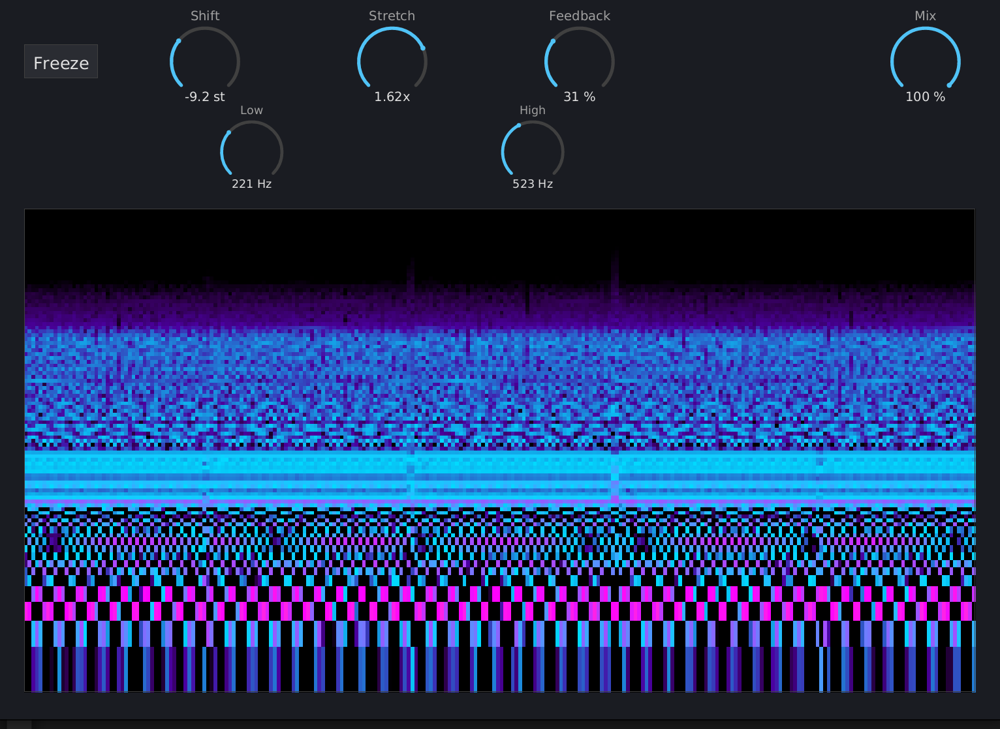

# Warp Zone Manual

{ width=60% }

## What is Warp Zone?

Warp Zone is a spectral shifting and stretching effect that transforms audio in the frequency domain using a phase vocoder. It can shift pitch independently of time, stretch the harmonic series to create inharmonic/metallic textures, freeze the spectrum into a sustained drone, and feed the output back into itself for compounding spectral effects.

A scrolling spectral waterfall display shows the output spectrum in real time with a psychedelic color palette.

## Installation

Build from source (requires nightly Rust):

```bash
cargo nih-plug bundle warp-zone --release
```

The bundler outputs to `target/bundled/`. Copy either the `.vst3` or `.clap` file to your plugin directory:

- **Linux**: `~/.vst3/` or `~/.clap/`
- **macOS**: `~/Library/Audio/Plug-Ins/VST3/` or `~/Library/Audio/Plug-Ins/CLAP/`
- **Windows**: `C:\Program Files\Common Files\VST3\` or `C:\Program Files\Common Files\CLAP\`

## Quick Start

1. Insert Warp Zone on a track
2. Set **Shift** to a non-zero value (e.g. +7 semitones for a perfect fifth up)
3. Play audio and watch the waterfall spectrogram respond
4. Try **Stretch** at 1.5x or 2.0x to hear harmonics spread apart
5. Add some **Feedback** for compounding spectral effects

## Controls

### Row 1

#### Freeze

Toggle button. When active, the phase vocoder stops accepting new input and loops the last captured FFT frame indefinitely, producing a sustained spectral drone from whatever audio was playing at the moment of activation.

While frozen, **Shift** and **Stretch** still apply -- you can sweep through the frozen spectrum. Freeze is transport-aware: output is silenced when the DAW transport is stopped.

#### Shift

Frequency shift in semitones. Range: -24 to +24 st. Default: 0.

Moves all frequency content up or down by a fixed musical interval. +12 shifts up one octave (440 Hz becomes 880 Hz), -12 shifts down one octave. Fractional values work: +7 is a perfect fifth.

This is pitch shifting without time stretching -- playback speed stays the same, only the pitch changes.

#### Stretch

Harmonic stretch ratio. Range: 0.5x to 2.0x. Default: 1.0x.

Scales the spacing between harmonics relative to the fundamental. At 1.0x, harmonic relationships are preserved. At 2.0x, the distance between each harmonic and the fundamental is doubled: a sound with harmonics at 200/400/600 Hz becomes 200/800/1200 Hz (approximately).

This breaks the natural harmonic series, producing inharmonic, bell-like, or metallic tones from ordinary sounds. At extreme values, familiar instruments become unrecognizable.

#### Feedback

Output-to-input feedback. Range: 0 to 100%. Default: 0%.

Feeds a percentage of the wet output back into the input. Each pass through the phase vocoder applies the shift/stretch again, causing spectral effects to compound:

- Small shift + feedback creates rising or falling Shepard tone spirals
- Stretch + feedback progressively warps harmonic structure until it dissolves
- High feedback values can produce self-oscillation and resonant spectral peaks

The feedback signal is clamped to prevent runaway gain.

### Row 2

#### Low

Low frequency cutoff for the effect range. Range: 20 to 20000 Hz. Default: 20 Hz.

Frequency bins below this value pass through unmodified -- no shift or stretch is applied to them. Use this to keep bass content anchored while warping the mids and highs.

#### High

High frequency cutoff for the effect range. Range: 20 to 20000 Hz. Default: 20000 Hz.

Frequency bins above this value pass through unmodified. Use this to leave high-frequency content natural while warping the lows and mids.

Together, **Low** and **High** define the frequency window where spectral processing is active.

### Far Right

#### Mix

Dry/wet blend. Range: 0 to 100%. Default: 100%.

At 100%, the output is fully processed. At 0%, the output is the original dry signal (delayed to match latency). Intermediate values blend the two for parallel processing.

## Waterfall Display

The main display area shows a scrolling spectral waterfall (spectrogram) of the plugin's output:

- **Horizontal axis**: time (newest on the right, scrolling left)
- **Vertical axis**: frequency (low at the bottom, high at the top, logarithmically spaced)
- **Color**: magnitude mapped through a psychedelic palette -- black (silence) through deep purple, indigo, cyan, magenta, hot pink, to white (loud)

The display updates at 60 FPS with 128 frequency bins and 256 time columns. It shows the output spectrum after shift/stretch processing, so you can see the effect in real time.

## How It Works

Warp Zone uses a **phase vocoder** -- a well-established technique for frequency-domain audio manipulation:

1. **Analysis**: Input audio is windowed (4096-sample Hann window, 75% overlap) and transformed via FFT into the frequency domain.

2. **Phase tracking**: For each frequency bin, the instantaneous frequency is estimated by measuring the phase deviation from the expected phase increment between successive frames.

3. **Bin remapping**: Each bin is mapped to a new target frequency determined by the Shift and Stretch parameters. Magnitude is distributed to adjacent target bins via linear interpolation. When multiple source bins map to the same target, the highest-magnitude source wins (prevents phase accumulation artifacts).

4. **Phase accumulation**: Output phases are accumulated using the correct phase vocoder formula: `expected_target_increment + source_phase_deviation`. This preserves phase coherence.

5. **Synthesis**: The remapped spectrum is transformed back to the time domain via inverse FFT, windowed, and overlap-added to produce the output.

When Shift is 0 and Stretch is 1.0x, the phase vocoder is bypassed entirely (direct bin copy) for perfect transparent passthrough.

## Resizing

The plugin window is freely resizable by the host (drag the window edges in your DAW). The layout scales automatically to fit.

## Interaction

- **Drag vertically** on any dial to adjust (up = increase)
- **Shift+drag** for fine control (10x slower)
- **Double-click** any dial to reset to default
- **Click** the Freeze button to toggle

## Technical Notes

- **Latency**: 4096 samples (~85 ms at 48 kHz), automatically compensated by the host
- **FFT size**: 4096, hop size 1024 (75% overlap, Hann window)
- **No audio-thread allocations** -- process() never allocates heap memory
- **CPU rendering** -- tiny-skia (software rasterizer) + fontdue (glyph cache) + softbuffer (pixel buffer). No OpenGL, no GPU drivers loaded
- **Lock-free visualization** -- spectral magnitudes are shared between audio and GUI threads via atomic storage, with no locks or channels
- **Phase vocoder identity bypass** -- when shift=0 and stretch=1.0, the FFT bins are copied directly without phase accumulation, ensuring bit-perfect passthrough (within overlap-add precision)

## Formats

- CLAP
- VST3
- Standalone (JACK or ALSA backend)

## License

GPL-3.0-or-later
