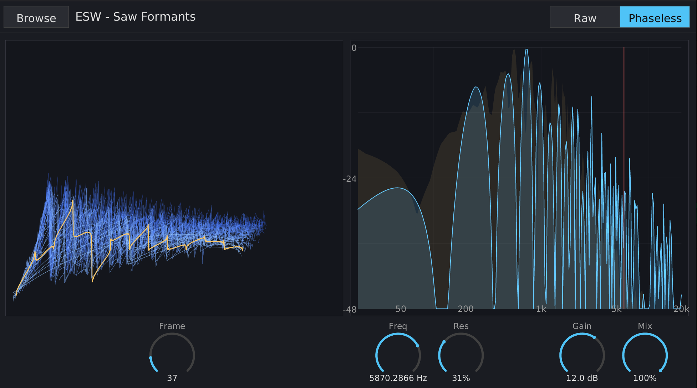

# Overview

Wavetable Filter is an audio effect plugin (VST3/CLAP) that uses wavetable frames as FIR filter kernels. Instead of using traditional filter designs, the frequency response is shaped by the spectral content of a wavetable — giving you complex, evolving filter shapes that aren't possible with conventional EQ or filter plugins.

The plugin supports two filtering modes:

- **Raw** — Direct time-domain convolution. Linear-phase response with pre-ringing around transients.
- **Phaseless** — STFT magnitude-only filtering. Preserves transient shape with no pre-ringing, at the cost of slight temporal smearing from the STFT overlap-add process.

{ width=100% }

# Interface

The editor window is freely resizable — drag any edge or corner to change its size. The size is persisted with your DAW project. All on-screen elements scale proportionally; a minimum of ~700×500 keeps the layout intelligible.

## Top strip

- **Browse** — Open a file dialog to load a `.wav` or `.wt` (Surge-compatible) wavetable file.
- **Wavetable name** — The stem of the currently loaded wavetable file, shown between the Browse button and the mode selector.
- **Mode** — Stepped selector with two segments: **Raw** and **Phaseless**. Click a segment to switch modes.

## Visualizations

- **3D Wavetable View** (left) — Shows all frames of the loaded wavetable in an overhead perspective. The active frame is highlighted in orange. Click anywhere in the view to toggle between the 3D overview and a 2D face-on view of the current interpolated frame.
- **Filter Response** (right) — Shows the frequency response of the current filter kernel on a log-frequency/dB scale. A faint amber shadow shows the input audio spectrum when audio is flowing, making it easier to set the cutoff by eye. The red vertical line marks the cutoff frequency.

## Controls

All dials support:

- **Vertical drag** — up to increase, down to decrease.
- **Shift+drag** — fine adjustment (finer pixels-per-unit).
- **Double-click** — reset to default.
- **Right-click** — open a text-entry field seeded with the current value (unit stripped). Press Enter to commit, Escape to cancel; clicking outside or starting a drag auto-commits.

When the DAW is driving a parameter via modulation or automation, a secondary orange arc on the dial shows the modulated position relative to the underlying user-set value.

### Frame Position

Selects which frame of the wavetable is used as the filter kernel. Adjacent frames are interpolated smoothly. Automating this parameter morphs the filter shape over time.

- Range: Frame 1 to the last frame in the wavetable
- Default: Frame 1

### Frequency

Sets the cutoff frequency of the filter. The wavetable's harmonic content is resampled so that harmonic 24 of the wavetable maps to this frequency.

- Range: 20 Hz to 20,000 Hz (logarithmic)
- Default: 1,000 Hz

### Resonance

Applies a comb-like emphasis at harmonic intervals of the cutoff frequency. At 0, the filter response is determined purely by the wavetable shape. Higher values create peaked, ringing resonances.

- Range: 0% to 100%
- Default: 0%

### Drive

Output gain applied after the filter and dry/wet mix. Useful for compensating level drops from heavy filtering or pushing the filtered signal harder.

- Range: -20 dB to +20 dB
- Default: 0 dB

### Mix

Blends between the dry (unfiltered) input and the wet (filtered) output.

- Range: 0% (fully dry) to 100% (fully wet)
- Default: 100%

# Filter Modes

## Raw Mode

Uses direct time-domain convolution with the wavetable frame as a 2048-tap FIR filter kernel. The convolution is SIMD-accelerated (16-wide f32 lanes).

**Characteristics:**

- Linear phase response — no phase distortion
- Symmetric pre-ringing around transients (characteristic of linear-phase FIR filters)
- Zero latency reported to the host
- Crossfades between kernels over ~20 ms when parameters change to avoid clicks

## Phaseless Mode

Uses Short-Time Fourier Transform (STFT) with 50% overlap-add. The input signal is windowed, FFT'd, multiplied by the filter's magnitude spectrum, and inverse-FFT'd. Only the magnitudes are applied — the input signal's phase is preserved.

**Characteristics:**

- No pre-ringing — transient shape is preserved
- Slight temporal smearing from the STFT overlap-add (inherent to the technique)
- Introduces latency of 1024 samples (reported to the host for automatic delay compensation)
- Frequency resolution of ~23.4 Hz per bin at 48 kHz

# Wavetable File Formats

## WAV files (.wav)

Standard WAV audio files. The file is divided into equal-sized contiguous frames. The frame size is determined by the total sample count divided by the number of frames. Common frame sizes are 256, 512, 1024, or 2048 samples.

## Surge Wavetable files (.wt)

Surge-compatible wavetable format with frame metadata embedded in the file header. These files explicitly encode the frame size and count, avoiding ambiguity.

# Tips

- **Start with the wavetable shape.** The filter's character comes primarily from the wavetable content. Try different wavetables to find interesting spectral shapes before adjusting other parameters.
- **Sweep Frame Position for evolving textures.** Automate or modulate the Frame Position parameter to morph the filter shape over time.
- **Use Phaseless mode on transient-heavy material** (drums, percussion) to avoid the pre-ringing artifacts of linear-phase filtering.
- **Use Raw mode for sustained sounds** (pads, drones) where linear-phase clarity matters more than transient preservation.
- **The Filter Response view shows your input spectrum** as a faint amber shadow when audio is playing. Use this to visually align the cutoff with the content you want to shape.
- **Click the wavetable view** to toggle between the 3D overview (all frames) and a 2D face-on view of the current interpolated frame.

# System Requirements

- **Formats:** VST3, CLAP, Standalone
- **OS:** Linux (other platforms may work but are untested)
- **CPU:** x86_64 or Apple Silicon (SIMD via Rust's portable `std::simd`)
- **DAW:** Any VST3 or CLAP compatible host (tested with Bitwig Studio)

# Building from Source

Requires nightly Rust (for portable SIMD).

```bash
# Plugin bundles (VST3 + CLAP)
cargo nih-plug bundle wavetable-filter --release

# Standalone binary
cargo build --bin wavetable-filter --release
```
